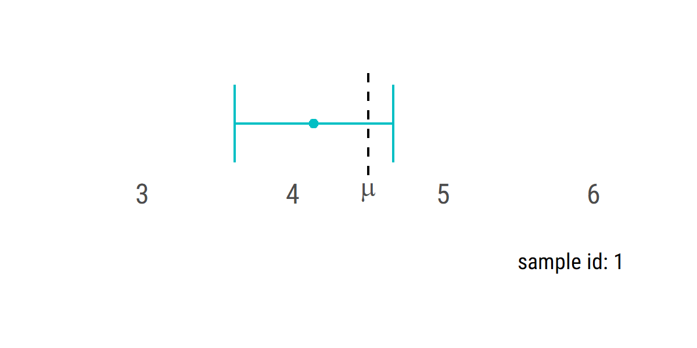
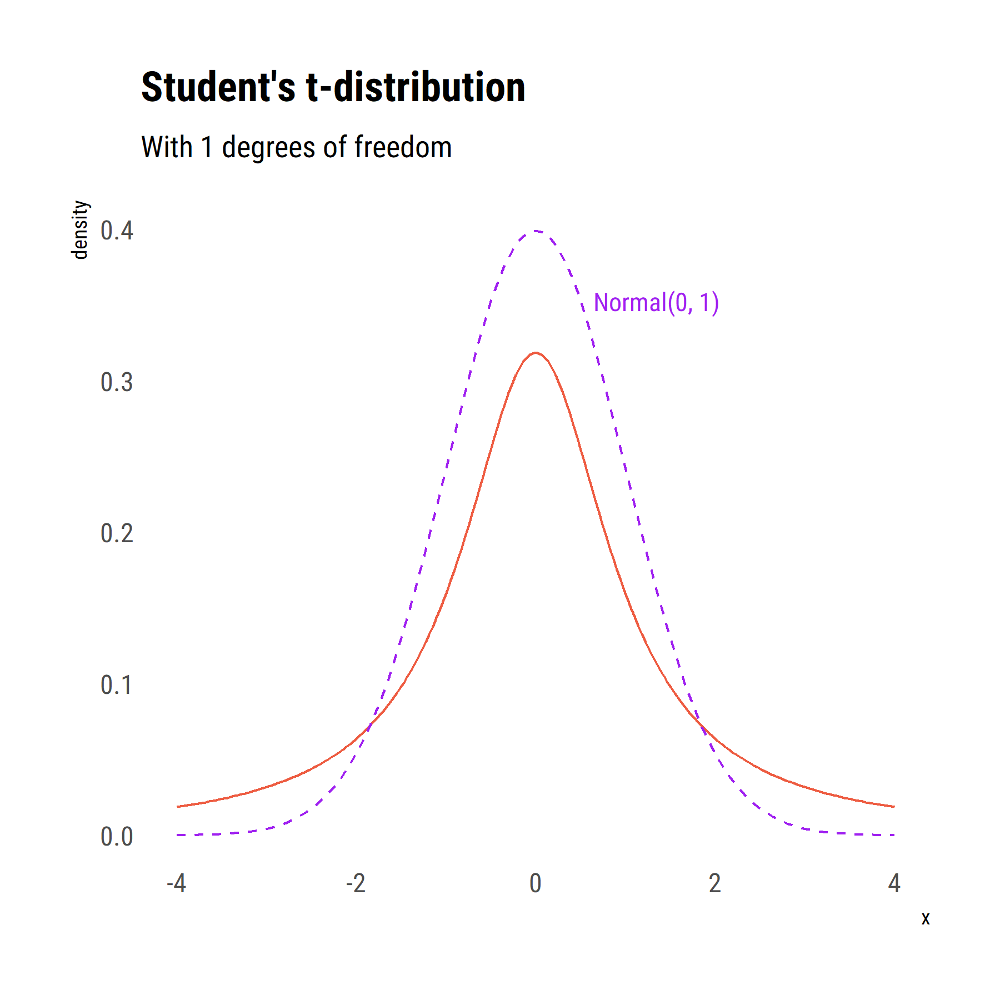

```{r setup, include=FALSE}
knitr::opts_chunk$set(echo = TRUE, dev.args = list(type = 'cairo'))
library(hrbrthemes)
library(ggplot2)
theme_set(theme_ipsum_rc(grid = F))
```

```{css, echo=FALSE}
ul li {
  margin-left: 1em;
}
ul ul {
  padding-left: 2em;
  font-size: smaller;
}
ul ul li {
  margin-bottom: 0;
}
```

This lecture forms part of the Introduction to Epidemiology course offered by the [Centre for Epidemiology Versus Arthritis](https://www.cfe.manchester.ac.uk/) at the University of Manchester.
There are two sessions on analytical epidemiology: the first session (last week) covered descriptive statistics; this second session introduces statistical inference.

Much of the material overlaps with the first few lectures in the [Statistical Modelling with Stata course](https://personalpages.manchester.ac.uk/staff/mark.lunt/stats_course.html), for which materials are available online.
There is less emphasis on statistical software here.
Examples, where provided, will be in the R programming language.
Unlike Stata, R is completely free, so you don't need an institutional software licence to follow along at home.
Download it from the [Comprehensive R Archive Network](https://cran.r-project.org/).

If you have questions or comments about any of these materials, please contact david.selby@manchester.ac.uk.

```{r echo=FALSE, eval=!interactive()}
knitr::include_url('lecture2.html')
```

- [View the lecture slides](lecture2.html)

Links to example datasets (or code to generate them) are provided in the respective sections below.

<!--## Introduction-->

## Sampling

Often, it is not practical to measure every subject in a population.
A reduced number of subjects---a sample---is measured instead.
This is cheaper, quicker and can be more thorough (i.e. allowing more detailed study of each subject).
The sample needs to be chosen in such a way as to be representative of the target population.
A _uniform random sample_ is the simplest way to achieve this: every subject in the population has the same probability of being included in the sample.

Suppose we have a population in which a variable $X$ has a mean $\mu$ and standard deviation $\sigma$.
Assume we don't know what the true value of $\mu$ actually is, and want to estimate it.
We take a random sample of size $n$ from the population.
Then:

- the sample mean $\bar x$ should be close to the population mean $\mu$
- each time a random sample is taken, the respective sample means $\bar x$ will vary slightly.

How much the means of different samples differ depends on:

1. sample size --- the mean of a small sample will vary more than the mean of a large sample
2. variance in the population --- if the variable measured only varies slightly across the whole population, the sample mean can only vary slightly as well.

In other words, the variance of $\bar X$ depends on the variance of $X$ and on the sample size $n$.

For example, consider a population consisting of 1000 copies of each of the digits 0, 1, ..., 9.
The frequency distribution of the values in this population is:

```{r uniform}
uniform <- data.frame(digit = rep(0:9, each = 1000))
ggplot(uniform) + aes(x = digit) +
  geom_bar(stat = 'count') +
  scale_x_continuous(breaks = 0:9)
```

We can draw random samples of size $n = 5, 25, 100$ from this population.
Let's draw 2000 samples of each of these three sizes and calculate the mean of $x$ (i.e. $\bar x$) for each sample.
The distributions of sample means are visualised below.

```{r samples, message=FALSE, warning = FALSE}
library(tidyverse)
# For each sample size, for 2000 samples
samples <- expand_grid(n = c(5, 25, 100),
                       sample_id = 1:2000) %>%
  group_by(n, sample_id) %>%
  # Draw the random samples
  summarise(samples = sample(uniform$digit, n)) %>%
  # Calculate the sample means
  summarise(x_bar = mean(samples),
            s = sd(samples))

# Visualise the distribution
ggplot(samples) + aes(x_bar) + geom_histogram() +
  facet_wrap(~ n, labeller = label_both) +
  xlab('sample mean')
```

### Properties of $\bar X$

- $\mathbb{E}(\bar X) = \mu$: on average, the sample mean is the same as the population mean; it is an *unbiased estimator*
- $\text{sd}(\bar X) = \frac{\sigma}{\sqrt{n}}$: the uncertainty in $\bar x$ increases with $\sigma$ and decreases with $n$. The standard deviation of the mean estimator is also called the *standard error*.
- $\bar X$ is normally distributed when $n$ is large, thanks to the [*Central Limit Theorem*](https://en.wikipedia.org/wiki/Central_limit_theorem).

### Standard error

The standard error is fundamental to frequentist (classical, non-Bayesian) statistics.
The standard error is the standard deviation of the _sampling distribution_ of a statistic.
The sampling distribution is the distribution of a statistic as sampling is repeated.
All statistics have sampling distributions.
Statistical inference is based on the standard error.

For example, consider our uniformly-distributed digits population, above.
It is a [discrete uniform distribution](https://en.wikipedia.org/wiki/Discrete_uniform_distribution) so we can actually calculate the theoretical mean and standard deviation for any such uniform distribution:

- $\mu = (a + b)/2 = 9 / 2 = 4.5$
- $\sigma = \sqrt{\frac{(b- a +1)^2 - 1}{12}} = \sqrt{99/12} \approx 2.87$,

where $a=0$ and $b=9$ are the boundaries of the distribution.
We can verify this by calculating the mean and standard deviation of the entire 10,000-strong population (`uniform`) in our example:

```{r echo = c(1, 3)}
mu <- mean(uniform$digit)
mu
sigma <- sd(uniform$digit)
sigma
```

In practice, of course, we don't know an underlying theoretical distribution, nor can we measure the entire population.
So we have to estimate $\mu$ and $\sigma$ from samples.

Let's compare the _expected_ (theoretical) versus _observed_ (sample) values of the mean and standard deviation for each sample size.

```{r sampling-distribution, echo = TRUE, eval = FALSE}
samples %>%
  summarise(mean_observed = mean(x_bar),
            sd_observed = sd(x_bar)) %>%
  mutate(mean_expected = mu,
         sd_expected = sigma / sqrt(n))
```
```{r sampling-distribution-table, echo = FALSE}
library(kableExtra)
samples %>%
  summarise(mean_observed = mean(x_bar),
            sd_observed = sd(x_bar)) %>%
  mutate(mean_expected = mu,
         sd_expected = sigma / sqrt(n)) %>%
  select(n, mean_expected, mean_observed, sd_expected, sd_observed) %>%
  kbl(col.names = c('n', 'expected', 'observed', 'expected', 'observed'), digits = 2) %>%
  add_header_above(c('Sample size' = 1, 'Mean' = 2, 'S.D.' = 2))
```

You can see that the average sample means ('observed') are very close to the true population mean ('expected'), and get closer as the sample size, $n$, increases.
Similarly, the standard deviations of the sample means ('observed') are very close to the theoretical value of $\sigma/\sqrt{n}$ ('expected') for each sample size, $n$.

This shows that the properties of $\bar X$, described above, are true.

## Confidence intervals

In real life, we don't know the true distribution of $X$, nor can we observe the entire population, so we cannot compare $\bar X$ with $\mu$ or $s$ (the sample standard deviation) with $\sigma$.

However, recall from the [previous lecture](https://personalpages.manchester.ac.uk/staff/david.selby/analysis/2021-03-23-summary/) that we can summarise distributions using _quantiles_.
And by the central limit theorem, the distribution of $\bar X$ is asymptotically normal as the sample size increases (even if the distribution of $X$ is not, as in our digits example).
Thus we can summarise the spread of $\bar X$ via the quantiles of the corresponding normal distribution.

### Reference ranges

In a box plot you might wish to summarise a dataset using the median and lower and upper quartiles, i.e. the 25^th^, 50^th^ and 75^th^ centiles.
For a normal distribution you can derive these quantiles using the mean and standard deviation.

If $x$ is normally distributed with mean $\mu$ and standard deviation $\sigma$, we have

- median = $\mu$
- lower quartile = $\mu - 0.674 \sigma$
- upper quartile = $\mu + 0.674 \sigma$

because the median, lower and upper quartiles of the _standard normal_ distribution (mean 0 and standard deviation 1) are 0, -0.674 and 0.674, respectively.
You can check this in a table of normal distribution quantiles, or using R:

```{r}
qnorm(c(.25, .5, .75), mean = 0, sd = 1)
```

That would give us the inter-quartile range of a normal distribution, representing 75% of the population.
In what interval do 95% of the population lie?
Instead of the first and third quartiles (25^th^ and 75^th^ centiles) we now want the 2.5^th^ and 97.5^th^ centiles, which are

```{r}
qnorm(c(.025, .975))
```

so the 95% **reference range** of a normal distribution, defined as the interval containing 95% of the population, is given by
\[(\mu - 1.96 \sigma, \mu + 1.96 \sigma).\]

```{r reference-range, echo=FALSE}
ggplot() +
  stat_function(fun = dnorm, xlim = qnorm(c(.025, .975)), geom = 'area',
                fill = 'steelblue2') +
  stat_function(fun = dnorm, geom = 'area', fill = 'tomato2',
                xlim = c(-5, qnorm(.025))) +
  stat_function(fun = dnorm, geom = 'area', fill = 'tomato2',
                xlim = c(qnorm(.975), 5)) +
  stat_function(fun = dnorm) +
  scale_x_continuous(limits = c(-3, 3), breaks = -3:3,
                     labels = c(expression(mu - 3*sigma),
                                expression(mu - 2*sigma),
                                expression(mu - sigma),
                                expression(mu),
                                expression(mu + sigma),
                                expression(mu + 2*sigma),
                                expression(mu + 3*sigma))) +
  scale_y_continuous(NULL, breaks = NULL) +
  annotate('text', 0, 0, label = '95% reference range', colour = 'white',
           family = 'Roboto Condensed', vjust = -1, size = 8) +
  annotate('text', x = c(-2.15, 2.15), y = 0, vjust = -.5, size = 4.5,
           colour = 'white', label = '2.5%', family = 'Roboto Condensed')
```

For our digits data, a 95% reference range is not appropriate because the digits are not normally distributed.

### Confidence intervals

In frequentist statistics, $\mu$ is assumed to be a fixed value.
And, of course, it's unknown.
You can rearrange the above formula to state that 95% of the intervals
$\bar x \pm 1.96 \frac{\sigma}{\sqrt{n}}$ contain $\mu$.

That is, _if you were able to draw samples repeatedly from the population_, and calculate the sample mean for each of them, then 95% of those intervals would contain $\mu$.
Typically we have just one of these samples (and of course don't know whether it is one that contains $\mu$ or not) and we call the interval a **95% confidence interval for the population mean**.

A reference range tells us about individual values in the distribution (but only assuming it's normally distributed); a confidence interval tells us about the _mean_ value (which is normally distributed for large $n$ thanks to the central limit theorem).

You don't have to pick 95%, of course, though it's conventional; you can pick any proportion you like, e.g. 50%, 80%, 99%.
The larger this percentage (confidence level), the wider the interval will be, for us to be able to say the intervals contain $\mu$ with that level of confidence.

```{r confidence-interval, echo=FALSE}
ggplot(data.frame(lower = qnorm(c(.25, .167, .1, .025, .005)),
                  upper = qnorm(c(.25, .167, .1, .025, .005), lower.tail = FALSE),
                  label = c('50%', '67%', '80%', '95%', '99%'),
                  y = dnorm(qnorm(c(.25, .167, .1, .025, .005))))) +
  stat_function(fun = dnorm) +
  scale_x_continuous(limits = c(-3, 3), breaks = -3:3,
                     labels = c(expression(bar(x) - over(3*sigma, sqrt(n))),
                                expression(bar(x) - over(2*sigma, sqrt(n))),
                                expression(bar(x) - over(sigma, sqrt(n))),
                                expression(bar(x)),
                                expression(bar(x) + over(sigma, sqrt(n))),
                                expression(bar(x) + over(2*sigma, sqrt(n))),
                                expression(bar(x) + over(3*sigma, sqrt(n))))) +
  scale_y_continuous('density') +
  geom_errorbarh(aes(xmin = lower, xmax = upper, colour = label, y = y),
                 show.legend = FALSE) +
  geom_label(aes(y = y, label = label), x = 0, label.size = 0)
```

A 100% confidence interval would be the entire possible range of the data: in the digits case it would be 0 to 9; for continuous data on the real number line it would be $-\infty$ to $+\infty$, which obviously isn't terribly helpful.

If $\sigma$ is unknown then you can use the sample standard deviation, $s$ (or sometimes denoted $\hat\sigma$),
\[s = \frac{\sum_{i=1}^n (x_i - \bar x)^2}{n-1}.\]

### Simulated example

Let's construct 95% confidence intervals around all of our sample means in the digits data.

```{r}
confints <- samples %>%
  mutate(lower = x_bar - 1.96 * s / sqrt(n),
         upper = x_bar + 1.96 * s / sqrt(n),
         contains_mu = 4.5 >= lower & 4.5 <= upper)
```

We would expect $\mu$ to fall within (approximately) 95% of the confidence intervals around the sample means.
What proportion of these intervals contained the true mean, in our samples?
How many of them contain the *true* population mean?

```{r}
confints %>%
  summarise(confidence = mean(contains_mu))
```

As the sample size increases, the distribution of the sample mean approaches normality and the confidence intervals contain the true population mean 95% of the time.
However, for small sample sizes ($n = 5$) the central limit theorem doesn't yet hold, so the 95% confidence intervals do not actually contain $\mu$ for 95% of the time.
In fact, for such small sample sizes with a standard deviation estimated from the data, we shouldn't be using the normal distribution at all: there is [a more appropriate distribution](#student-t) you should use in this situation.

Here is an illustrative animation.
Each frame is one sample from the population.

```{r confint-animated, echo = FALSE}
library(gganimate)
if (!file.exists('confint.gif')) {
  ggif <- confints %>%
    filter(n == 100) %>%
    ggplot() +
    aes(x_bar, '', colour = contains_mu) +
    geom_vline(xintercept = 4.5, linetype = 'dashed') +
    geom_errorbarh(aes(xmin = lower, xmax = upper)) +
    geom_point() +
    gganimate::transition_states(sample_id) +
    labs(y = NULL, x = NULL,
         colour = expression('contains' ~ mu),
         caption = 'sample id: {closest_state}') +
    scale_x_continuous(breaks = c(3:6, 4.5),
                       labels = c(3:6, expression(mu))) +
    theme(legend.position = 'none')
  
  animate(ggif, width = 4, height = 2, units = 'in', res = 300,
          nframes = 500, fps = 10,
          renderer = gifski_renderer('confint.gif'))
} else 
```

And here are all of the intervals shown together:

```{r confints, fig.width = 7, fig.height = 14}
confints %>%
  # Reorder the bars
  ungroup() %>% arrange(n, x_bar) %>%
  group_by(n) %>%
  mutate(order = row_number()) %>%
  # Visualise the data
  ggplot() +
  aes(xmin = lower, xmax = upper, y = order,
      colour = contains_mu) +
  facet_wrap(~ n, labeller = label_both, ncol = 1) +
  geom_errorbarh() +
  geom_vline(xintercept = 4.5, linetype = 'dashed') +
  labs(title = 'Confidence intervals for mean digit',
       subtitle = 'Which contain the true mean?',
       x = NULL, y = NULL,
       colour = expression('contains' ~ mu)) +
  scale_x_continuous(breaks = c(0, 4.5, 9)) +
  theme(axis.text.y = element_blank())
```

Is your sample's confidence interval one that contains $\mu$, or not?
You can never be sure!
But assuming the samples were drawn uniformly from the population, there is a 95% probability it contains the population mean.

### Real-world example

In 216 patients with primary biliary cirrhosis, serum albumin had a mean value of 34.46 g/l and a standard deviation of 5.84 g/l.

What is the 95% confidence interval for the mean serum albumin level?

1. The standard error is $\sigma/\sqrt{n} = 5.84 / \sqrt{216} = 0.397$.
2. Hence the 95% confidence interval for $\mu$ is
\[\begin{aligned}
\bar x \pm 1.96 \sigma/\sqrt{n}
&= 34.46 \pm 1.96 \times 0.397 \\
&= (33.68, 35.24) ~g/l.
\end{aligned}\]

So the mean value of serum albumin in the _population_ of patients with primary biliary cirrhosis is probably between 33.68 g/l and 35.24 g/l.

In R,

```{r}
# Directly get quantiles of normal distribution:
qnorm(c(.025, .975), mean = 34.46, sd = 5.84 / sqrt(216))
# Or manually calculate the interval:
34.46 + c(-1.96, 1.96) * 5.84 / sqrt(216)
```

### Proportional data

Consider a different example of a binary variable (i.e. can take one of two values), for example presence of a disease or a particular characteristic.
Let the proportion in the population with this quality be denoted by $p$---this is our unknown population parameter.

Suppose $X$ is the number of such people in the population.
Then $X$ is a discrete random variable with a [*binomial distribution*](https://en.wikipedia.org/wiki/Binomial_distribution) with parameters $n$ (the total number of subjects) and $p$ (the underlying probability of having the characteristic).

For small $n$, you can compute the probability of $X$ taking on particular values.
For example, if we have a fair coin ($p = 0.5$) and flip it 20 times then the probability of getting exactly 11 heads is
\[\begin{aligned}
\operatorname{Pr}(X = 11)
&= \textstyle\binom{20}{11} 0.5^{11} 0.5 ^9 \\
&= 0.16
\end{aligned}\]
i.e. about 1 in 6. In R, use the density (mass) function:

```{r}
dbinom(11, size = 20, prob = .5)
```

As with continuous variables, usually we're interested in intervals or ranges of possible values: what is the probability that we get 15 or more heads in 20 flips?
\[\begin{aligned}
\operatorname{Pr}(X \geq 15)
&= 1 - \operatorname{Pr}(X < 15) \\
&= 1 - \sum_{i=0}^{14} \operatorname{Pr}(X = i) \\
&= 0.021
\end{aligned}\]

Or in R:

```{r}
1 - sum(dbinom(0:14, 20, .5))
pbinom(14, 20, .5, lower.tail = FALSE)
```

With **large** populations, we can [approximate the binomial distribution with a normal distribution](https://en.wikipedia.org/wiki/Binomial_distribution#Normal_approximation) that has mean $np$ and variance $np(1-p)$.
Typically we're interested in the _proportion_, not the absolute count, so we divide by the constant $n$ to get a distribution with mean $p$ and standard deviation $\sigma = \sqrt{p(1-p)/n}$.

For example, imagine 100 subjects each receive two analgesics, $A$ and $B$, for one week in a randomly determined order.
They then state a preference for one drug: 65 prefer $A$ and 35 prefer $B$.
Calculate a 95% confidence interval for the proportion preferring $A$.

Using a normal approximation, the standard error of $p$ is $\sqrt{0.65 \times 0.35 / 100} = 0.0477$, thus the 95% confidence interval is
\[0.65 \pm 1.96 \times 0.0477 = (0.56, 0.74),\]
so we estimate that in the general population, between 56% and 74% of people tend to prefer $A$ (equivalently: the underlying probability of preferring $A$ is likely to fall between 0.56 and 0.74).

In R,

```{r}
0.65 + qnorm(c(.025, .975)) * sqrt(.65 * .35 / 100)
```

Or you could calculate an 'exact' confidence interval using the binomial distribution:

```{r}
qbinom(c(.025, .975), size = 100, prob = 0.65)
```

In fact, the R function `qbinom` uses a normal approximation behind the scenes, as it's computationally more efficient.

### Confidence intervals in R

To produce confidence intervals in R, you can specify the mathematical formula yourself as in the examples above, use the function `confint()` on a fitted model object, or perform a specific kind of test using the dedicated function, e.g. `t.test()`.

```{r}
# Generate one sample
x <- sample(uniform$digit, 100)
```

```{r}
# Manually construct the 95% confidence interval:
mean(x) + qt(c(.025, .975), 99) * sd(x) / sqrt(100)

# Get it via a linear model object
confint(lm(x ~ 1))

# Via a t-test function
t.test(x)
```

In this case, we are estimating the standard deviation from the data so we need to use quantiles from the $t$-distribution with $n-1$ degrees of freedom via `qt()`; using `qnorm` (i.e. &pm;1.96) would give a similar (but not identical) result.

## Other sampling distributions

We have already seen the normal and binomial distributions, as sampling distributions for location parameters in continuous and proportional data.

But there are many more possible questions that we can ask under the classical frequentist framework.
For example:

- Are these two groups alike?
- Is a certain outcome more common in the presence of a particular exposure?
- Can we predict a response measure from other variables?

### Student's $t$-distribution {#student-t}

Many statistics, like the sample mean, can be considered normally distributed, if the sample size is large enough.
If the statistic $T$ has mean $\mu$ and standard deviation $\sigma$, then $\frac{T - \mu}{\sigma}$ has a normal distribution with mean 0 and standard deviation 1.
**But** in practice we rarely know the population variance; we only have an estimate in the form of the sample standard deviation $s$.
For a sample of size $n$, the statistic $\frac{T-\mu}{s}$ has a [**Student's $t$-distribution**](https://en.wikipedia.org/wiki/Student%27s_t-distribution) with $n-1$ degrees of freedom.

Why "Student"?
[William Sealy Gossett](https://en.wikipedia.org/wiki/William_Sealy_Gosset), chief brewer at Guinness in Dublin, developed the theory for analysing small sample sizes of barley for brewing.
When publishing academic papers scientists at the company had to use pseudonyms and avoid mentioning 'beer' or 'Guinness', to avoid divulging trade secrets to competitors.


The Student's $t$-distribution is a bit like a normal distribution but has fatter tails, allowing for more extreme values in small samples with unknown variance.
As $n$ gets larger, the corresponding $t$-distribution (with $n-1$ degrees of freedom) approximates a normal distribution, so for larger sample sizes the distinction is less important.

```{r, normal-v-student, echo=FALSE}
if (!file.exists('tdist.gif')) {
  tgif <- expand_grid(x = seq(-4, 4, length = 200),
                      k = c(1:9, seq(10, 50, by = 10), 100)) %>%
    mutate(dt = dt(x, k)) %>%
    ggplot() + aes(x, dt) +
    geom_line(colour = 'tomato2') +
    transition_states(k) +
    stat_function(fun = dnorm, colour = 'purple', linetype = 'dashed') +
    xlim(-4, 4) +
    annotate('text', label = 'Normal(0, 1)',
             x = .5, y = dnorm(.5), colour = 'purple',
             family = 'Roboto Condensed', hjust = -.1) +
    labs(title = 'Student\'s t-distribution',
         subtitle = 'With {closest_state} degrees of freedom',
         y = 'density')
  animate(tgif, width = 6, height = 6, units = 'in', res = 300,
          nframes = 250, fps = 10,
          renderer = gifski_renderer('tdist.gif'))
} else 
```

You can access quantiles of the $t$ distribution in R using the `qt` function.
They will generally give slightly wider confidence intervals than a normal distribution on the same data.

In our digits data, if we assume the population standard deviation $\sigma$ is _not_ known, then the 'correct' way to generate confidence intervals is to use the $t$-distribution rather than the normal.
This is why the confidence intervals from earlier tended to under-cover the distribution for the smaller sample sizes.

```{r digits-t}
samples %>%
  mutate(lower = x_bar + qt(.025, n - 1) * s / sqrt(n),
         upper = x_bar + qt(.975, n - 1) * s / sqrt(n),
         contains_mu = 4.5 >= lower & 4.5 <= upper) %>%
  summarise(confidence = mean(contains_mu))
```

Using the more appropriate choice of sampling distribution, the confidence intervals capture the true population more reliably when the sample size is small.

### $\chi^2$ distribution

The $\chi_k^2$ [(chi-squared) distribution](https://en.wikipedia.org/wiki/Chi-square_distribution) is the distribution of the sum of squares of $k$ independent standard normal random variables,
\[Q = \sum_{i=1}^k (Z_i - \bar Z)^2.\]

We use it when measuring the difference between expected and observed frequencies ($E_i$ and $O_i$) in a contingency table.

Why? Because the [test statistic](https://en.wikipedia.org/wiki/Pearson%27s_chi-squared_test) for such a difference is
\[X^2 = \sum_{i=1}^n \frac{(O_i - E_i)^2}{E_i} = \sum_{i=1}^k \frac{O_i^2}{E_i} - n,\]
which is asymptotically distributed as $\chi^2$ with $k-1$ degrees of freedom.

Consider a new example.
Suppose we observe two groups of people: one exposed to a particular treatment (e.g. a drug or environmental condition) and the other not.
We wish to investigate whether the exposure appears to increase the incidence of a particular outcome (a disease or event) or not.

The data are organised in a $2\times 2$ contingency table of the form

```{r contingency, echo=FALSE}
data.frame(Exposed = c('$n_{11}$', '$n_{12}$'),
           Unexposed = c('$n_{21}$', '$n_{22}$'),
           row.names = c('Outcome', 'No outcome')) %>%
  kable(escape = TRUE) %>%
  kableExtra::kable_styling()
```

If there were no effect---i.e. the likelihood of experiencing the event is the same for exposed and unexposed subjects---then the $X^2$ statistic is distributed as $\chi_1^2$ with 1 degree of freedom (the number of groups minus 1).

As in our digits example, we simulate 2000 samples of size $n = 5, 25, 100$ subjects, with an underlying baseline odds of 1.3 of experiencing the outcome: i.e. you are 30% more likely than not to experience the outcome in general (equivalently: the chance of experiencing the outcome is about 57%).

The empirical distribution of the $X^2$ statistics is plotted below and compared with the density of a theoretical $\chi_1^2$ distribution.

```{r chisq-dens, echo=TRUE, fig.width=5, fig.height=7}
# Simulate the contingency tables
samples2 <- expand_grid(n = c(5, 25, 100),
                        sample_id = 1:5000) %>%
  group_by(n, sample_id) %>%
  summarise(exposure = as.integer(runif(n) > .5),
            outcome = runif(n) < plogis(log(1.3))) %>%
  group_by(n, sample_id, exposure) %>%
  summarise(yes = sum(outcome), no = sum(!outcome))

# Calculate the X^2 statistics
X2 <- samples2 %>%
  mutate(p = sum(yes) / sum(yes + no),
         Eyes = p * (yes + no),
         Eno = (1 - p) * (yes + no)) %>%
  summarise(Xsq = sum((yes - Eyes)^2 / Eyes +
                        (no - Eno)^2 / Eno))

# Visualise the distribution (compared with chi^2, df = 1)
ggplot(X2) + aes(Xsq) +
  stat_function(fun = function(x) dchisq(x, df = 1),
                linetype = 'dashed', alpha = .5) +
  geom_density(colour = 'purple', fill = 'purple', alpha = .5) +
  facet_wrap(~n, ncol = 1, labeller = label_both) +
  coord_cartesian(xlim = c(0, 6)) +
  labs(x = expression(X^2), y = 'density') +
  theme(axis.text.y = element_blank())
```

Because there is no true effect in our population, the mode of the distribution is zero: you'd expect, in the long run, the difference in outcomes between the 'exposed' and 'unexposed' groups to be about zero, with some random fluctuation.

If you really want to confirm the simulated $X^2$ statistics are distributed $\chi_1^2$, then recall from the last lecture that the most reliable way to compare observed data with theoretical quantiles of a distribution is via a quantile--quantile plot:

```{r chisq-qq, fig.height = 3, fig.width = 7}
ggplot(X2) +
  aes(sample = Xsq) +
  stat_qq_line(distribution = qchisq, dparams = list(df = 1)) +
  stat_qq(distribution = qchisq, dparams = list(df = 1)) +
  facet_wrap(~n, scales = 'free_y', labeller = label_both) +
  labs(x = expression('theoretical'~chi[1]^2~'quantiles'),
       y = expression(X^2))
```

## Hypothesis testing and why it's a bad idea

We can never say exactly what a population-level parameter is without measuring the *entire* population.
Confidence intervals tell us that a particular range _probably_ contains the population value, with some level of confidence.

**Null hypothesis significance testing** is a way of comparing a simple theory against the information conveyed by our dataset (via the test statistic).

### The null hypothesis

The *null hypothesis* is a very simple, uninteresting model that we seek to disprove or falsify.
For example:

- 'the mean value is equal to zero'
- 'the two means are the same'
- 'exposure does not change the probability of outcome'
- 'inter-group variation is no more than within groups'

The idea is then to show that the observed data would be so unlikely under such a model, that the null model must be wrong.
This supposedly lends credence to the idea that, therefore, a proposed _alternative hypothesis_ is a better explanation.
However, this is a false dichotomy.

1. Make two bad explanations
2. Show first bad explanation is bad
3. ???
4. Therefore, second bad explanation must be better
5. Profit

Nobody _seriously_ expects these hypotheses to be exactly true in the first place: they are [straw men](https://warwick.ac.uk/fac/sci/statistics/crism/workshops/hypothesistesting/gelman.pdf).
We already know that [**all models are wrong**](https://en.wikipedia.org/wiki/All_models_are_wrong); the goal should be to think about how to improve a model, rather than simply 'rejecting' it.

Nonetheless, null hypothesis significance testing is rampant in the literature, so you should understand it when you see it.

### The alternative hypothesis

The alternative hypothesis is, supposedly, what you are trying to show, by rejecting the null hypothesis.
It represents everything that isn't the null.

For example, suppose we want to investigate the hypothesis that Drug A lowers blood pressure more than Drug B.
Then, the null hypothesis, denoted $H_0$, is that Drugs A and B have exactly the same effect on blood pressure.
If we can show that, under various assumptions, the null hypothesis is an implausible explanation of our data, then we *reject* the null hypothesis, and try to use this to support the alternative hypothesis, $H_1$, that therefore Drugs A and B have different effects on blood pressure.

### Testing hypotheses using confidence intervals

Recall that a confidence interval summarises what we think about the population parameter (such as the mean), based on our observed data.

Suppose we had a null hypothesis that the population mean of our uniform digits, $\mu$, is exactly equal to 3.0.

1. Assume the null hypothesis is true, i.e. $\mu_0 = 3.0$
2. Construct a $(1-\alpha)\%$ confidence interval around $\bar x - \mu_0$
3. Is the difference between observed sample mean and (proposed) population mean plausible?
  - If the confidence interval contains 0, do not reject $H_0$: the observed difference is plausible (at the $\alpha$ level) under the null hypothesis.
  - If not, we reject $H_0$ at this level of confidence: it's implausible (but not impossible) that we would observe such a difference under the null distribution. Thus, the data support the idea that perhaps $H_0$ is false.
  
(Equivalently: you can draw a confidence interval around $\mu_0$ and see if it contains $\bar x$, or draw a confidence interval around $\bar x$ and see if it contains $\mu_0$.)

On our digits data, we see that the more data we have, the more likely we are to (correctly in this case) reject the null hypothesis (obviously we know the true mean is $\mu = 4.5$ here, not 3).
  
```{r conf-tests, fig.height = 14, fig.width = 7}
test3 <- samples %>%
  mutate(lower = x_bar - 3.0 + qt(.025, n - 1) * s / sqrt(n),
         upper = x_bar - 3.0 + qt(.975, n - 1) * s / sqrt(n),
         plausible = 0 >= lower & 0 <= upper)

test3 %>%
  arrange(n, x_bar) %>%
  mutate(order = row_number()) %>%
  ggplot() +
  aes(xmin = lower, xmax = upper, y = order) +
  geom_linerange(aes(colour = plausible)) +
  facet_wrap(~n, labeller = label_both, ncol = 1) +
  geom_vline(xintercept = 0, linetype = 'dashed') +
  xlab(expression(bar(x) - mu[0])) +
  scale_y_continuous(NULL, breaks = NULL) +
  scale_colour_discrete(NULL,
                        labels = c(expression('reject'~H[0]),
                                   expression('do not reject'~H[0])))
```

Because $\mu \neq 3.0$, every time we fail to reject $H_0$ in this example, we are committing a [**type II error**](https://en.wikipedia.org/wiki/Type_I_and_type_II_errors): failing to reject a false null hypothesis; i.e. a false negative conclusion.
As we can see, the type II error rate (usually denoted $\beta$) decreases as the statistical power (here, the sample size) increases.
Our sample size $n=5$ appears to be severely underpowered, while the sample size of $n=100$ sample digits seems to have good statistical power.

```{r}
test3 %>%
  summarise(typeII = mean(plausible))
```

### Type I error ($\alpha$)

A **type I error** means the null hypothesis is true, but we reject it, based on the data.
In other words, a type I error is a false positive result.
The type I error rate is equal to the significance level of a confidence interval (or test): so a 95% confidence interval has a 5% type I error rate; a 99% confidence interval has a 1% type I error rate.

### Type II error ($\beta$)

A **type II error** means the null hypothesis is not true, but our sample does not provide enough evidence to reject it.
In other words, a type II error is a false negative result.
The type II error rate depends on the study size and the size of the true effect: large effects are easier to detect than small ones.
The **power** of a study, denoted $1 - \beta$, is the probability of detecting a given effect, if it exists (i.e. the sensitivity).

### Example: one sample *t*-test

The following data are uterine weights (in mg) for a sample of 20 rats. Previous work suggests that the mean uterine weight for the stock from which the sample was drawn was 24mg. Does this sample confirm that suggestion?

```{r}
x <- c(9, 14, 15, 15, 16, 18, 18, 19, 19, 20,
       21, 22, 22, 24, 24, 26, 27, 29, 30, 32)
mean(x)
sd(x)
```

Here, we have a sample mean, $\bar x = 21$, and wish to compare it with a hypothetical value, $\mu_0 = 24$.
The population standard deviation $\sigma$ is not known, so we estimate it from the data to be $s = 5.91$.

Hence, we construct a confidence interval around the difference $\bar x - 24$, using the quantiles of the Student's $t$-distribution with 19 degrees of freedom.
This procedure is called a **one sample t-test**.

The 95% confidence interval for the difference in means is

```{r}
(mean(x) - 24) + qt(c(.025, .975), 19) * sd(x) / sqrt(20)
```

and it does not contain zero.
This means that, if the true population mean were really $\mu_0 = 24$, we would expect to see a sample mean of this size less than 5% of the time.
The data offer evidence that the null hypothesis is unlikely: rather, we'd expect with 95% confidence that the population mean lies in the interval

```{r}
mean(x) + qt(c(.025, .975), 19) * sd(x) / sqrt(20)
```

You can speed up this procedure in R by simply calling the `t.test` function or fitting a (null) linear model:

```{r}
t.test(x - 24)
t.test(x) # interval does not contain 24
confint(lm(x ~ 1)) # to get confidence interval only
```

### Example: unpaired (two-sample) *t*-test

Rather than comparing a hypothetical value for the mean with sample observations, we can compare two samples, to investigate whether they are drawn from a population with the same mean value.

For two samples, $x$ and $y$, of sample sizes $n_x$ and $n_y$ respectively,

- the null hypothesis is $H_0: \mu_x = \mu_y$
- the alternative hypothesis is $H_1: \mu_x \neq \mu_y$

What is the sampling distribution of the statistic $\bar y - \bar x$?
Assuming the population standard deviation(s) is unknown, the mean difference, divided by its standard error, has a Student's $t$-distribution on $n_x + n_y - 2$ degrees of freedom.

What is the standard error of $\bar y - \bar x$?
We can either

- assume the two populations have a common standard deviation
- assume they do not have the same standard deviation.

In the latter, more general case, the estimated standard error for $\bar y = \bar x$ is
\[\text{se}(\bar x = \bar y) = \sqrt{\frac{s_y^2}{n_y} + \frac{s_x^2}{n_x}}.\]

Hence, we can draw a confidence interval around our statistic to see if the difference in sample means is within the range we'd expect from a population with true common mean.

Using the height and weight dataset ([`htwt.csv`](https://personalpages.manchester.ac.uk/staff/david.selby/stata/2020-04-02-summarising/htwt.csv)), let's investigate whether the height in centimetres (as measured by the nurse) is equal between male and female patients.

We can perform the test in three ways and compare the result:

1. By hand, using mathematical formulae
2. Using the `t.test` function
3. Using a linear regression model

```{r, echo = -1}
htwt <- read.csv('../../_stata/2020-04-02-summarising/htwt.csv')
# Method 1
htwt %>%
  filter(!is.na(nurseht)) %>%
  group_by(sex) %>%
  # Compute summary statistics
  summarise(mean = mean(nurseht),
            sd = sd(nurseht),
            n = n()) %>%
  # Generate a confidence interval for the mean difference
  summarise(stderror = sqrt(sum(sd^2 / n)),
            lower = diff(mean) + qt(.025, sum(n) - 2) * stderror,
            upper = diff(mean) + qt(.975, sum(n) - 2) * stderror)

# Method 2
with(htwt, t.test(nurseht[sex == 'male'], nurseht[sex == 'female']))

# Method 3
confint(lm(nurseht ~ sex, data = htwt))
```

All three methods give the same result: if the population of male and female patients really had a common mean height, it would be very unlikely that we would see a difference in sample means as great as observed here.
Thus, we conclude that male and female patients in this population probably have different mean heights (and that this mean height difference is between 11.9 and 14.5 cm).

### Example: comparing proportions

We wish to compare sample proportions $p_1 = \frac a{n_1}$ and $p_2 = \frac b{n_2}$.

The null hypothesis is the populations have a common value for the proportion: $\pi_1 = \pi_2 = \pi$.

The standard error of $p_1 - p_2$ is $\sqrt{\pi (1- \pi)(\frac1{n_1}+\frac1{n_2})}$, where we estimate $\pi$ with $p = \frac{a + b}{n_1 + n_2}$.

Then
\[\frac{p_1 - p_2}{\sqrt{p(1-p)(\frac1{n_1} + \frac1{n_2})}}\]
can be compared to a standard normal distribution.

(Equivalently, we can compare $p_1 - p_2$ with a normal distribution with standard deviation equal to the standard error given in the denominator.)

Use the dataset [`epicourse.csv`](https://personalpages.manchester.ac.uk/staff/david.selby/stata/2020-04-29-binary/epicourse.csv), which describes a sample of patients and whether or not they experience various types of pain.

Let's investigate whether the proportion of patients complaining of back pain (`back_p`) is different between the sexes.

```{r, echo=2}
epicourse <- read.csv('https://personalpages.manchester.ac.uk/staff/david.selby/stata/2020-04-29-binary/epicourse.csv')
xtab <- with(epicourse, table(sex, back_p))
xtab
```

Using the formulae above, we can calculate the test statistic (the difference in observed proportions) and produce a confidence interval for the difference.

```{r}
n <- rowSums(xtab)
p_MF <- xtab[, 'yes'] / rowSums(xtab)
p <- sum(xtab[, 'yes']) / sum(xtab)
stderror <- sqrt(p * (1 - p) * (1 / n[1] + 1 / n[2]))
qnorm(c(.025, .975), mean = diff(p_MF), sd = stderror)
```

The 95% confidence interval for the difference in mean proportions does not contain zero, implying that such a difference in observed proportions would be unlikely, if there really were no difference in risk in the population, between the sexes.
Thus we reject the null hypothesis at the 5% level.

The above procedure used a normal approximation to the $\chi^2$ distribution.
We can also perform a $\chi^2$ test directly on the contingency table using dedicated R functions:

```{r}
prop.test(xtab)
chisq.test(xtab) # same result but less detailed output
```

## $p$-values

In some of the R output above you may have seen mention of $p$-values.
When performing a null hypothesis significance test, a $p$-value is a less informative summary of the same procedure.
Unlike a confidence interval, it conflates sample size with effect size, and is generally inferior, as well as being harder to interpret and less transparent about the underlying process.
However, for some reason, many researchers in the literature like to report $p$-values, so you should know what they are when you see them.

A $p$ value is the probability that we would observe a test statistic at least as extreme as that observed, under the null hypothesis (in the case of a two-sided test. A one-sided test would offer the probability that the test statistic is 'at least this small' or 'at least this large').
If we drew a confidence interval for which our test statistic fell exactly on the boundary, its significance level would be $p$.
In other words, the $p$-value is the quantile of the test statistic in the distribution.

The _critical region_ is the tail (usually 2.5% or 5%) region in which a test statistic would result in a $p$-value that would reject the null hypothesis.
The _critical value_ is the boundary that defines the region: typically the 2.5^th^ or 97.5^th^ quantile of the null sampling distribution.

### Digits and $p$-values

Let's demonstrate this graphically, using example of the uniformly-sampled digits data, and the null hypothesis that $\mu_0 = 3.0$.
Under the null hypothesis, the sampling distribution of the sample mean is given below, with the 95% confidence interval shaded in blue.

Suppose we observe a sample mean of $\bar x = 4.64$ with $s = 3.04$ and sample size $n = 25$.
The sample mean is marked with the vertical red line.
We can already see it falls outside the confidence interval, so an observation like this would cause us to reject the null hypothesis.

```{r pvalue1, echo=FALSE}
pval <- pt((4.64 - 3) / 3.04 * 5, 24, lower.tail = F)

ggplot() +
  stat_function(fun = function(x) dt((x - 3) / 3.04 * 5, 24),
                xlim = qt(c(.025, .975), 24) * 3.04 / 5 + 3,
                geom = 'area', fill = 'steelblue2', alpha = .5) +
  stat_function(fun = function(x) dt((x - 3) / 3.04 * 5, 24),
                xlim = c(4.64, 10),
                geom = 'area', fill = 'tomato2') +
  stat_function(fun = function(x) dt((x - 3) / 3.04 * 5, 24)) +
  scale_x_continuous(NULL,
                     limits = c(1, 5),
                     breaks = c(0, 2, 3, 4, 6, 4.64),
                     labels = c(0, 2, expression(mu[0]), 4, 6, expression(bar(x)))) +
  geom_vline(xintercept = 3, linetype = 'dashed') +
  geom_vline(xintercept = 4.64, colour = 'tomato2') +
  ylab('density') +
  annotate('text', label = bquote(p == .(signif(pval, 1))),
           x = 4.64, y = 0, colour = 'tomato2',
           vjust = -1, hjust = -0.1)
```

The $p$-value is the total area to the right of the line.
Because this area (probability mass) is less than 2.5%, we reject the null hypothesis.
The confidence interval gives us the same information; all the $p$-value tells us is how far into the critical region the test statistic lies (which you could see anyway by comparing the statistic with the boundaries of the confidence interval).
It's therefore arguable that the $p$-value imparts no useful information that isn't already provided by the confidence interval.

Here is another example.
Suppose we observe $\bar x = 2.8$ with $s = 3.56$ and $n = 25$.
Clearly, this value falls inside the confidence interval, so we would not reject the null hypothesis.
The $p$-value is $p = 0.39$, describing what quantile of the distribution is represented by the observed sample mean.
It implies that there is a 39% chance we would observe a value at least this small (or an 80% chance 'at least this extreme', if doing a _two-sided test_), under the null hypothesis.

```{r pvalue2, echo=FALSE}
pval <- pt((2.8 - 3) / 3.56 * 5, 24, lower.tail = T)

ggplot() +
  stat_function(fun = function(x) dt((x - 3) / 3.56 * 5, 24),
                xlim = qt(c(.025, .975), 24) * 3.56 / 5 + 3,
                geom = 'area', fill = 'steelblue2', alpha = .5) +
  stat_function(fun = function(x) dt((x - 3) / 3.56 * 5, 24),
                xlim = c(-10, 2.8),
                geom = 'area', fill = 'tomato2') +
  stat_function(fun = function(x) dt((x - 3) / 3.56 * 5, 24)) +
  scale_x_continuous(NULL,
                     limits = c(1, 5),
                     breaks = c(0, 2, 3, 4, 6, 2.8),
                     labels = c(0, 2, expression(mu[0]), 4, 6, expression(bar(x)))) +
  geom_vline(xintercept = 3, linetype = 'dashed') +
  geom_vline(xintercept = 2.8, colour = 'tomato2') +
  ylab('density') +
  annotate('text', label = bquote(p == .(signif(pval, 2))),
           x = 2.8, y = 0, colour = 'white',
           vjust = -1, hjust = 1.3, size = 6)
```

### Hypothesis tests and confidence intervals

_Coming soon_

```{r}
tab1 <- as.table(rbind(c(6, 6), c(2, 5)))
tab2 <- as.table(rbind(c(600, 731), c(200, 269)))
dimnames(tab1) <- dimnames(tab2) <-
  list(outcome = c('no', 'yes'),
       exposed = c('no', 'yes'))

tab1
tab2

# Odds ratio
tab1[1, 1] / tab1[1, 2] * tab1[2, 2] / tab1[2, 1]
chisq.test(tab1)

tab2[1, 1] / tab2[1, 2] * tab2[2, 2] / tab2[2, 1]
chisq.test(tab2)
```

```{r}
df <- data.frame(
  yes = c(200, 269),
  no = c(600, 731),
  exposure = c(0, 1)
)

model <- glm(cbind(yes, no) ~ exposure, df, family = binomial)
log_odds <- coef(model)
exp(confint(model))
```

## Practical exercises

All practical exercises are lifted from lecture 3 of the Statistical Modelling with Stata course.

https://personalpages.manchester.ac.uk/staff/david.selby/stata/2020-04-03-sampling/

I may write some new ones here, later.

## Further reading

Robert P. Abelson (1995). _Statistics as Principled Argument_. https://doi.org/10.4324/9781410601155

Andrew Gelman et al. (1995--2020). _Bayesian Data Analysis_. http://www.stat.columbia.edu/~gelman/book/
