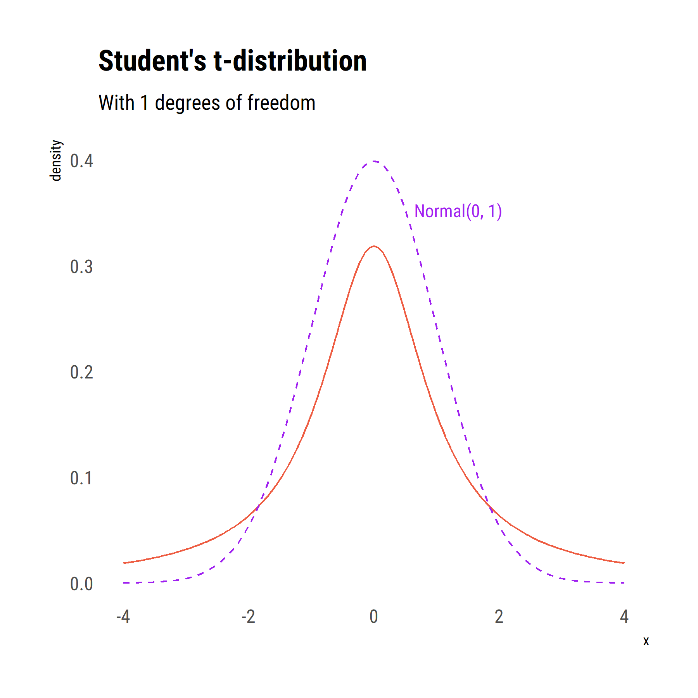

layout: true
background-image: url(cfe-logo.jpg)
background-position: 97% 97%
background-size: 70px

```{r setup, include=FALSE}
knitr::opts_chunk$set(comment = '', warning = FALSE, message = FALSE,
                      fig.width = 8, fig.height = 5, out.width = '100%',
                      dpi = 300, echo = FALSE)
library(hrbrthemes)
library(extrafont)
loadfonts(device = 'win')
library(ggplot2)
theme_set(theme_ipsum_rc(grid = F) +
            theme(plot.margin = margin(5, 5, 5, 5)))
library(tidyverse)

purple <- '#644BA5'
pink <- '#EB64A0'
blue <- '#0073BE'
green <- '#37A53C'
yellow <- '#FAB900'
red <- '#E61E32'
```

```{css, echo=FALSE}
dd {
  font-size: 90%;
}

.purple { color: #644BA5; }
.pink { color: #EB64A0; }
.blue { color: #0073BE; }
.green { color: #37A53C; }
.yellow { color: #FAB900; }
.red { color: #E61E32; }
    
ul, ol {
  padding-left: 0;
}
ol li {
  margin-top: .5em;
}
ul ul, dl, ol ul {
  padding-left: 1em;
}
code {
  color: #644BA5;
}

.remark-slide-number {
  position: inherit;
}

.remark-slide-number .progress-bar-container {
  position: absolute;
  bottom: 0;
  height: 4px;
  display: block;
  left: 0;
  right: 0;
}

.remark-slide-number .progress-bar {
  height: 100%;
  background-color: #0073BE;
}


```

---

## Statistical inference

1. Sampling
    - sample mean estimator
    - normal quantiles
2. Confidence intervals
    - non-normal probability distributions
3. Null hypothesis significance testing
4. Examples

.small[https://personalpages.manchester.ac.uk/staff/david.selby/analysis.html]

???

Questions or comments about last week's worksheet

---

## Principles of sampling

- Often, it is not practical to measure every subject in a population.
- A reduced number of subjects—a .red[**sample**]—is measured instead.
  - cheaper
  - quicker
  - can be more thorough
- Sample needs to be chosen in such a way as to be representative of the __target population__
  - e.g. uniform random sampling

---

## Estimating from random samples

Suppose we have a population in which a variable $X$ has an (unknown) mean $\mu$ and standard deviation $\sigma$.

--

We want to estimate $\mu$ from a random sample of size $n$:

- sample mean $\bar x$ should be close to the population mean $\mu$
- in every sample the sample mean $\bar x$ will vary slightly

--

The variation in $\bar x$ depends on

- variance in the population, $\sigma^2$
- random variation due to sample size, $n$

---

### Example: population

Consider a population comprising $1000$ copies of each of the digits $0, 1, \dots, 9$.

--

```{r uniform, echo = 1, fig.height = 3}
uniform <- data.frame(digit = rep(0:9, each = 1000))
ggplot(uniform) + aes(x = digit) +
  geom_bar(stat = 'count', fill = blue) +
  scale_x_continuous(breaks = 0:9)
```

---

### Example: samples

1. Sample $n = 5, 25, 100$ digits from the population
2. Draw 2000 uniform random samples of each size
3. Compute sample mean $\bar x = \frac1n\sum x_i$ of each sample
4. Visualise distribution of sample means

--

```{r mean-dist, fig.height=3, cache = TRUE}
library(tidyverse)
# For each sample size, for 2000 samples
samples <- expand_grid(n = c(5, 25, 100),
                       sample_id = 1:2000) %>%
  group_by(n, sample_id) %>%
  # Draw the random samples
  summarise(samples = sample(uniform$digit, n)) %>%
  # Calculate the sample means
  summarise(x_bar = mean(samples),
            s = sd(samples))

# Visualise the distribution
ggplot(samples) + aes(x_bar) +
  geom_density(fill = blue, colour = blue) +
  geom_rug(colour = blue, alpha = .1) +
  facet_wrap(~ n, labeller = label_both) +
  xlab(expression('sample mean,' ~ bar(x))) +
  scale_x_continuous(breaks = seq(0, 9, by = 1.5))
```

---

### Properties of $\bar X$ estimator

- $\mathbb{E}(\bar X) = \mu$: the average sample mean is equal to the true population mean (*unbiased*)
- $\operatorname{Var}(\bar X) = \frac{\sigma^2}n$: uncertainty increases with $\sigma$, decreases with $n$ (*consistent*)
- $\bar X$ becomes normally distributed as $n$ increases (*Central Limit Theorem*)

For large $n$,
$$\bar X \sim \text{Normal}\Bigl(\mu, \frac{\sigma^2}{n}\Bigr).$$

---

## Standard error

- The standard deviation of the .blue[sampling distribution] of a statistic
- The sample distribution: the distribution of a statistic as sampling is repeated
- All statistics have sampling distributions
- Statistical inference is based on the standard error

e.g. $$\text{s.e.}(\bar X) = \frac{\sigma}{\sqrt n}$$

---

### Example: sampling distribution of $\bar X$

Population mean $\mu = 4.5$  
Population s.d. $\sigma = 2.87$

.small[From our 2000 random samples:]

```{r table, dependson='mean-dist', cache = TRUE}
mu <- mean(uniform$digit); sigma <- sd(uniform$digit)
samples %>%
  summarise(mean_observed = mean(x_bar),
            sd_observed = sd(x_bar)) %>%
  mutate(mean_expected = mu,
         sd_expected = sigma / sqrt(n)) %>%
  select(n, mean_expected, sd_expected, everything()) %>%
  knitr::kable(col.names = c('$n$', '$\\mu$', '$\\frac{\\sigma}{\\sqrt{n}}$',
                      '$\\text{mean}(\\bar x)$', '$\\text{sd}(\\bar x)$'),
               digits = 2)
```

- average sample mean very close to $\mu$
- standard deviation very close to $\frac{\sigma}{\sqrt{n}}$

---

## Normal quantiles

```{r dnorm, fig.height = 4}
ggplot() +
  stat_function(fun = dnorm, xlim = c(-4, 4)) +
  scale_x_continuous(breaks = c(-3:3),
                     labels = c(expression(mu - 3 * sigma),
                                expression(mu - 2 * sigma),
                                expression(mu - sigma),
                                expression(mu),
                                expression(mu + sigma),
                                expression(mu + 2 * sigma),
                                expression(mu + 3 * sigma))) +
  annotate('segment', x = 0, y = 0,
           xend = 0, yend = dnorm(0),
           colour = purple,
           linetype = 'dashed') +
  ylab(NULL) +
  theme(axis.text.y = element_blank())
```

$$X \sim \text{Normal}(\mu, \sigma^2)$$

---

## Normal quantiles

```{r dnorm-1sigma, fig.height = 4}
ggplot() +
  stat_function(fun = dnorm, xlim = c(-1, 1),
                geom = 'area', fill = yellow) +
  stat_function(fun = dnorm, xlim = c(-4, 4)) +
  scale_x_continuous(breaks = c(-3:3),
                     labels = c(expression(mu - 3 * sigma),
                                expression(mu - 2 * sigma),
                                expression(mu - sigma),
                                expression(mu),
                                expression(mu + sigma),
                                expression(mu + 2 * sigma),
                                expression(mu + 3 * sigma))) +
  annotate('text', x = 0, y = .1,
           size = 16,
           label = paste(signif(100 * (pnorm(1) - pnorm(-1)), 3), '%'),
           colour = 'white',
           family = 'Roboto Condensed') +
  ylab(NULL) +
  theme(axis.text.y = element_blank())
```

$$X \sim \text{Normal}(\mu, \sigma^2)$$

???

One standard deviation away from the mean.

---

## Normal quantiles

```{r dnorm-2sigma, fig.height = 4}
ggplot() +
  stat_function(fun = dnorm, xlim = c(-2, 2),
                geom = 'area', fill = green) +
  stat_function(fun = dnorm, xlim = c(-4, 4)) +
  scale_x_continuous(breaks = c(-3:3),
                     labels = c(expression(mu - 3 * sigma),
                                expression(mu - 2 * sigma),
                                expression(mu - sigma),
                                expression(mu),
                                expression(mu + sigma),
                                expression(mu + 2 * sigma),
                                expression(mu + 3 * sigma))) +
  annotate('text', x = 0, y = .1,
           size = 16,
           label = paste(signif(100 * (pnorm(2) - pnorm(-2)), 3), '%'),
           colour = 'white',
           family = 'Roboto Condensed') +
  ylab(NULL) +
  theme(axis.text.y = element_blank())
```

$$X \sim \text{Normal}(\mu, \sigma^2)$$
???

Two standard deviations away from the mean.

Remember this, as it'll come up again.

---

## Normal quantiles

```{r dnorm-3sigma, fig.height = 4}
ggplot() +
  stat_function(fun = dnorm, xlim = c(-3, 3),
                geom = 'area', fill = pink) +
  stat_function(fun = dnorm, xlim = c(-4, 4)) +
  scale_x_continuous(breaks = c(-3:3),
                     labels = c(expression(mu - 3 * sigma),
                                expression(mu - 2 * sigma),
                                expression(mu - sigma),
                                expression(mu),
                                expression(mu + sigma),
                                expression(mu + 2 * sigma),
                                expression(mu + 3 * sigma))) +
  annotate('text', x = 0, y = .1,
           size = 16,
           label = paste(signif(100 * (pnorm(3) - pnorm(-3)), 3), '%'),
           colour = 'white',
           family = 'Roboto Condensed') +
  ylab(NULL) +
  theme(axis.text.y = element_blank())
```

$$X \sim \text{Normal}(\mu, \sigma^2)$$

???

Three standard deviations away from the mean.

The normal distribution is unbounded, so to get (exactly) 100% coverage you'd need to cover an infinite distance in both directions.

---

## Normal quantiles

What intervals would cover

1. 50%
2. 75%
3. 95%

of a normal distribution with mean $\mu$ and variance $\sigma^2$?

.small[These inter-quantile ranges are sometimes called .blue[**reference ranges**].]

???

From the graphs on the previous slides, we could hazard a guess that the answer to (3) is approximately $2 \sigma$.

---

## Normal quantiles

Looking up the quantiles in R:

```{r, echo = -1}
options(digits = 2)
qnorm(c(.75, .875, .975))
```

So, by symmetry of the normal distribution:

1. 50%: $(\mu - 0.67 \sigma, \mu + 0.67 \sigma)$

2. 75%: $(\mu - 1.15 \sigma, \mu + 1.15 \sigma)$

3. 95%: $(\mu - 1.96 \sigma, \mu + 1.96 \sigma)$

???

Here we are using the fact that you can subtract any normal distribution's mean and divide by its standard deviation to get a standard normal:

$$X \sim N(\mu, \sigma^2)$$

then

$$Z = \frac{X - \mu}{\sigma} \sim N(0, 1)$$

and conversely, $X = \sigma Z + \mu$.

---

layout: false
class: inverse, middle, center

# Confidence intervals

<!--*After the break:* **quantitative data**-->

---

layout: true
background-image: url(cfe-logo.jpg)
background-position: 97% 97%
background-size: 70px

---

## Confidence intervals

- In frequentist statistics, the population mean $\mu$ is assumed to be a fixed, unknown value.

--

- $\bar X \sim \text{Normal}(\mu, \frac{\sigma^2}{n})$ &nbsp; .small[for sufficiently large *n*]

--

So if we could sample repeatedly from the population, 95% of sample means would fall in the range $\mu \pm 1.96 \frac{\sigma}{\sqrt{n}}$.

--

Therefore $\mu$ lies within 95% of intervals $$\bigl(\bar x - 1.96 \frac{\sigma}{\sqrt{n}}, \bar x + 1.96 \frac{\sigma}{\sqrt{n}} \bigr).$$

--

This is the .blue[**95% confidence interval**] for the mean.

---

### Example: confidence intervals

From our 2000 samples of $n$ digits, generate confidence intervals for the mean:

$$\Bigl(\bar x - 1.96 \times \frac{2.87}{\sqrt{n}}, \: \bar x + 1.96 \times \frac{2.87}{\sqrt{n}}\Bigr)$$

How many of them contain true population mean $\mu = 4.5$?

```{r confints, dependson='mean-dist', cache=TRUE}
confints <- samples %>%
  mutate(lower = x_bar - 1.96 * sigma / sqrt(n),
         upper = x_bar + 1.96 * sigma / sqrt(n),
         contains_mu = 4.5 >= lower & 4.5 <= upper)
confints %>%
  summarise(contain_mu = sum(contains_mu),
            percent = 100 * mean(contains_mu)) %>%
  knitr::kable(col.names = c('$n$', 'CIs containing $\\mu$', '%'))
```

---

### Example: confidence intervals

From our 2000 samples of $n$ digits, generate confidence intervals for the mean:

$$\Bigl(\bar x - 1.96 \times \frac{2.87}{\sqrt{n}}, \: \bar x + 1.96 \times \frac{2.87}{\sqrt{n}}\Bigr)$$

```{r confint-gif, out.width = '80%', dependson='confints'}
if (!file.exists('confint2.gif')) {
  library(gganimate)
  ggif <- confints %>%
    filter(n == 100) %>%
    ggplot() +
    aes(x_bar, '', colour = contains_mu) +
    geom_vline(xintercept = 4.5, linetype = 'dashed') +
    geom_errorbarh(aes(xmin = lower, xmax = upper)) +
    geom_point() +
    gganimate::transition_states(sample_id) +
    labs(y = NULL, x = NULL,
         colour = expression('contains' ~ mu),
         caption = 'sample id: {closest_state}') +
    scale_x_continuous(breaks = c(3:6, 4.5),
                       labels = c(3:6, expression(mu))) +
    theme(legend.position = 'none')
  
  animate(ggif, width = 4, height = 2, units = 'in', res = 300,
          nframes = 500, fps = 10,
          renderer = gifski_renderer('confint2.gif'))
} else 
```

---

### Example: primary biliary cirrhosis

In 216 patients with primary biliary cirrhosis, serum albumin had a mean value of $\bar x = 34.46~g/l$.
The population standard deviation is known to be $\sigma = 5.84~g/l$.

What is the 95% confidence interval for the mean serum albumin level?

--

1. The standard error is $\sigma/\sqrt{n} = 5.84 / \sqrt{216} = 0.397$.

--

2. The 95% confidence interval for the mean is given by
$$\bar x \pm 1.96 \sigma/\sqrt{n}
= 34.46 \pm 1.96 \times 0.397$$

--

3. Hence, mean serum albumin in the population is *probably* between $33.68~g/l$ and $35.24~g/l$.

---

### Example: primary biliary cirrhosis

```{r cirrhosis-example}
ggplot() +
  stat_function(fun = dnorm, args = list(mean = 34.46, sd = 5.84 / sqrt(216)),
                xlim = qnorm(c(.025, .975), 34.46, 5.84 / sqrt(216)),
                geom = 'area', fill = pink) +
  stat_function(fun = dnorm, args = list(mean = 34.46, sd = 5.84 / sqrt(216)),
                xlim = c(33, 36), n = 500) +
  annotate('text', 34.46, 0, label = '95%\nC.I.', vjust = -.5,
           size = 8,
           colour = 'white', family = 'Roboto Condensed') +
  xlab('mean serum albumin, g/l') +
  ylab('density')
```

---

## Other sampling distributions

So far we've seen the sampling distribution of the sample mean $\bar X$ where the population variance is known.

But there are other data types to consider.

1. Means with *unknown* variance
2. Comparing two sample means
3. Counts and proportions data
4. Contingency tables

---

## Other sampling distributions

If statistic $T$ has mean $\mu$ and standard deviation $\sigma$, then $\frac{T-\mu}{\sigma}$ has distribution $\text{Normal}(0, 1)$.

But, in practice we *rarely* know the population variance; only the estimate
$$s = \sqrt{\sum_{i=1}^n \frac{(x_i - \bar x)^2}{n-1}}.$$

What is the distribution of $\frac{T - \mu}{s}$ ?

---

### Student's $t$-distribution

$\dfrac{T - \mu}{s}$ has a ***t*-distribution** with $n-1$ degrees of freedom.

- A $t$-distribution looks like a normal distribution, but with *fatter tails*, allowing for more extreme values.
- At small sample sizes where $\sigma$ is unknown, a *normal* 95% confidence interval will fail to cover $\mu$
- As sample size increases, $t$-distribution approximates a normal

.footnote[W. S. Gossett, chief brewer at Guinness, developed the *t*-distribution for analysing small sample sizes of barley, under pseudonym &lsquo;Student&rsquo;]

---

```{r student-t, out.width = '92%'}

```

---

### Student's $t$ distribution

If variance is unknown, simply plugging in $s$ for $\sigma$ will result in confidence intervals that are too narrow!

2000 &times; 95% confidence intervals on sample digits data:

.pull-left[
$$\bar x \pm 1.96 \frac{s}{\sqrt{n}}$$

```{r student-v-normal, dependson='mean-dist', cache = TRUE}
normal_ints <- samples %>%
  mutate(lower = x_bar - 1.96 * s / sqrt(n),
         upper = x_bar + 1.96 * s / sqrt(n),
         contains_mu = 4.5 >= lower & 4.5 <= upper)

normal_ints %>%
  summarise(contain_mu = sum(contains_mu),
            percent = 100 * mean(contains_mu)) %>%
  knitr::kable(col.names = c('$n$', 'Contains $\\mu$', '%'))
```
]

.pull-right[
$$\bar x \pm t_{n-1}(2.5\%) \frac{s}{\sqrt{n}}$$

```{r student-v-normal2, dependson='mean-dist', cache = TRUE}

t_ints <- samples %>%
  mutate(lower = x_bar + qt(.025, n - 1) * s / sqrt(n),
         upper = x_bar + qt(.975, n - 1) * s / sqrt(n),
         contains_mu = 4.5 >= lower & 4.5 <= upper)

t_ints %>%
  summarise(contain_mu = sum(contains_mu),
            percent = 100 * mean(contains_mu)) %>%
  knitr::kable(col.names = c('$n$', 'Contains $\\mu$', '%'))
```
]

---

### Proportional data

Binary counts follow a **binomial distribution** with success probability $p$ and number of trials $n$.

--

When $n$ is large, we use approximation $\text{Normal}(np, np(1-p))$, and so proportions are distributed
$$\text{Normal}\Bigl(p, \frac{p(1-p)}{n}\Bigr).$$
--

If $x$ is the number of successes (outcomes), a 95% confidence interval is

$$\frac{x}{n} \pm 1.96 \times \sqrt{\frac{\frac{x}n(1-\frac{x}n)}{n}}.$$

---

### Proportional data: example

100 subjects each receive two analgesics, $A$ and $B$, for 1 week, in random order.
They then state a preference for one drug: 65 prefer $A$ and the remaining 35 prefer $B$.

Calculate a 95% confidence interval for the proportion preferring $A$.

--

$$\frac{65}{100} \pm 1.96 \times \sqrt{\frac{\frac{65}{100}\cdot\frac{35}{100}}{100}} = (0.56, 0.74)$$

So we estimate between 56% and 74% of people tend to prefer analgesic $A$.

???

Equivalently, the underlying probability of preferring $A$ is likely to fall between 0.56 and 0.74, with 95% confidence.

---

### Proportional data: example

```{r, echo = TRUE}
binom.test(65, 100)
```

---

### Proportional data: example

```{r, echo = TRUE}
prop.test(65, 100)
```

---

### Proportional data: example

```{r prop-data}
ggplot() +
  stat_function(fun = dnorm, args = list(mean = 65, sd = sqrt(100 * .65 * .35)),
                xlim = qbinom(c(.025, .975), 100, .65),
                geom = 'area', fill = green) +
  stat_function(fun = dnorm, args = list(mean = 65, sd = sqrt(100 * .65 * .35)),
                xlim = c(0, 100), n = 500) +
  annotate('text', 65, 0, label = '95%\nC.I.', vjust = -.5,
           size = 8,
           colour = 'white', family = 'Roboto Condensed') +
  xlab('prefer A, out of 100') +
  ylab('binomial density')
```

---

### Normal approximation to binomial

```{r, normal-v-binomial, echo = FALSE}
if (!file.exists('binomdist.gif')) {
  bingif <-
    tibble(n = seq(2, 100, by = 1)) %>%
    group_by(n) %>%
    summarise(x = 0:n) %>%
    mutate(dbn = dbinom(x, n, .65)) %>%
    ggplot() + aes(x, dbn) +
    geom_line(colour = 'tomato2', size = 1) +
    geom_point(colour = 'tomato2', aes(group = 1L)) +
    transition_states(n) +
    view_follow() +
    labs(subtitle = 'Binomial(p = 0.65, n = {closest_state}) density', y = NULL)
  animate(bingif, width = 6, height = 4, units = 'in', res = 300,
          nframes = 500, fps = 20, device = 'ragg_png', rewind = TRUE,
          renderer = gifski_renderer('binomdist.gif'))
} else knitr::include_graphics('binomdist.gif')
```

---

### The $\chi^2$ distribution

The sum of squares of $k$ normally-distributed random variables has a $\chi^2(k)$ distribution.
Useful as the sampling distribution for

- sample variance, $S^2 = \frac1{n-1}\sum_{i} (X_i - \bar X)^2$
- comparing contingency tables, $X^2 = \sum_i \frac{(O_i-E_i)^2}{E_i}$

```{r chisq, fig.height = 3, out.width = '80%'}
ggplot() +
  stat_function(fun = dchisq, args = list(df = 3),
                xlim = qchisq(c(.025, .975), 3), n = 500,
                geom = 'area', fill = yellow) +
  stat_function(fun = dchisq, args = list(df = 3),
                xlim = c(0, 10), n = 500) +
  ylab(expression(chi[3]^2 ~ 'density'))
```

---

layout: false
class: inverse, middle, center

# Null hypothesis significance testing

---

layout: true
background-image: url(cfe-logo.jpg)
background-position: 97% 97%
background-size: 70px

---

class: middle

### Null hypothesis significance testing

Don't do it!

---

### Null hypothesis significance testing

We can never say what the population parameter $\mu$ is without measuring .blue[*entire*] population.

Confidence intervals suggest the population parameter *probably* lies within a particular range

A hypothesis test suggests the population parameter is probably .red[*not*] a particular value.

--

In practice: is a posited value inside our $(1-\alpha)\%$ confidence interval or not?

---

### Null hypothesis significance testing

1. Start with an interesting research hypothesis: e.g. &lsquo;Drug A lowers blood pressure more than Drug B&rsquo;.

2. Form the opposite (.blue[null]) hypothesis, i.e. &lsquo;Drugs A and B have the same effect on blood pressure&rsquo;.

3. Assess the weight of evidence .red[*against*] the .blue[*null*] hypothesis

4. If there is sufficient evidence against the null hypothesis, it can be rejected.

???

If we can show that, under various assumptions, the null hypothesis is an implausible explanation of our data, then we *reject* the null hypothesis, and try to use this to support the alternative hypothesis, $H_1$, that therefore Drugs A and B have different effects on blood pressure.

---

### Null and alternative hypothesis

#### The null hypothesis

- Simplest acceptable model, denoted $H_0$
- If the null hypothesis is true, the world is uninteresting
- Must be expressible numerically (via a .blue[test statistic], $T$)
- sampling distribution of test statistic must be known

#### The alternative hypothesis

- Alternative model, denoted $H_1$
- $¬H_0 \implies H_1$
- Any possibility not covered by null hypothesis

???

The thinking goes: if $H_0$ is an implausible explanation for $T$, then $H_1$ must, by default, be a better explanation.

---

### Example: rat weights data

.small[Data are uterine weights (in mg) for a sample of **20 rats**. Previous work suggests that the mean uterine weight for the stock from which the sample was drawn was **24mg**. Does this sample confirm that?]

```{r, echo = TRUE}
x <- c(9, 14, 15, 15, 16, 18, 18, 19, 19, 20,
       21, 22, 22, 24, 24, 26, 27, 29, 30, 32)
```

--

```{r, echo = -1}
options(digits = 4)
mean(x)
sd(x)
```

???

Null hypothesis: $H_0: \mu = 24$

Alternative hypothesis: $H_1: \mu \neq 24$

---

### Example: rat weights data

.small[Data are uterine weights (in mg) for a sample of **20 rats**. Previous work suggests that the mean uterine weight for the stock from which the sample was drawn was **24mg**. Does this sample confirm that?]

Test statistic: $\frac{\bar X - \mu}{s/\sqrt{n}} \sim t_{n-1}$

```{r, echo = TRUE}
mean(x) + qt(c(.025, .975), 19) * sd(x) / sqrt(20)
```

95% confidence interval for $\bar X$ .red[does not contain] $\mu = 24$:

Reject $H_0$ at the 5% level. *Implausible* that sample data were drawn from population with mean 24 mg.

???

The test statistic $T$ here is really the *difference* between the sample mean and the proposed population mean.
The mean of this difference would be zero.
But you can rearrange the formula to give a confidence interval for the sample mean (rather than the mean difference), which has a nicer interpretation.

---

### Example: rat weights data

.small[Data are uterine weights (in mg) for a sample of **20 rats**. Previous work suggests that the mean uterine weight for the stock from which the sample was drawn was **24mg**. Does this sample confirm that?]

Test statistic: $\frac{\bar X - \mu}{s/\sqrt{n}} \sim t_{n-1}$

```{r, echo = TRUE}
(mean(x) - 24) + qt(c(.025, .975), 19) * sd(x) / sqrt(20)
```

95% confidence interval for $(T - \mu)$ .red[does not contain] 0:

Reject $H_0$ at the 5% level. *Implausible* that sample data were drawn from population with mean 24 mg.

???

If the population (stock) really had a mean uterine weight of 24 mg and we took repeated random samples from it, then less than 5 samples in 100 would have a sample mean that was this much smaller (or greater) than 24 mg.

---

### Example: rat weights data

.small[Data are uterine weights (in mg) for a sample of **20 rats**. Previous work suggests that the mean uterine weight for the stock from which the sample was drawn was **24mg**. Does this sample confirm that?]

```{r, echo = TRUE}
t.test(x - 24)
```

---

### Example: rat weights data

.small[Data are uterine weights (in mg) for a sample of **20 rats**. Previous work suggests that the mean uterine weight for the stock from which the sample was drawn was **24mg**. Does this sample confirm that?]

```{r, echo = TRUE}
model <- lm(x ~ 1)
confint(model)
confint(model) - 24
```

---

### Example: rat weights data

```{r rats}
ggplot(data.frame(x = x)) +
  stat_function(fun = function(y) dt((y - mean(x)) / sd(x) * sqrt(20), 19),
                xlim = qt(c(.025, .975), 19) * sd(x) / sqrt(20) + mean(x),
                geom = 'area', fill = pink) +
  stat_function(fun = function(y) dt((y - mean(x)) / sd(x) * sqrt(20), 19),
                xlim = c(15, 30)) +
  geom_vline(xintercept = 24, linetype = 'dashed') +
  labs(x = 'uterine weight (mg)', y = 'density')
```

???

It's outside the confidence interval, yes, but do we care about a difference of 3 mg? This is one of the reasons why showing a confidence interval can be more useful than a $p$-value.

---

### Unpaired, two-sample $t$-test

For comparing two sample means.

If we have two samples, $x$ of size $n_x$ and $y$ of size $n_y$,
$$\begin{aligned}
H_0: \mu_x &= \mu_y \iff \mu_x - \mu_y = 0 \\
H_1: \mu_x &\neq \mu_y \iff \mu_x - \mu_y \neq 0
\end{aligned}$$

Test statistic $$T = \frac{\bar x - \bar y}{\operatorname{se}(\bar x - \bar y)} \sim t_{n_x + n_y - 2},$$
Assume $\sigma_x \neq \sigma_y$, then
$\operatorname{se}(\bar x - \bar y) = \sqrt{\frac{s_x^2}{n_x} + \frac{s_y^2}{n_y}}.$

???

The rats data compared one sample to a hypothetical population mean value.

Another common situation is to compare the means of two (independent) samples: are they drawn from a population with a common mean?

Equivalently: are they drawn from two populations with the same mean?

---

### Example: comparing heights

Is the mean height (in cm) the same for male and female patients in the `htwt` dataset?

--

```{r htwt, fig.height = 4, cache = TRUE}
htwt <- read.csv('https://personalpages.manchester.ac.uk/staff/david.selby/stata/2020-04-02-summarising/htwt.csv')
htwt <- htwt %>%
  group_by(sex) %>%
  mutate(meanht = mean(nurseht, na.rm = TRUE))
ggplot(htwt) +
  geom_density(aes(nurseht, fill = sex, colour = sex),
               show.legend = FALSE) +
  geom_rug(aes(nurseht, colour = sex), alpha = .3,
           show.legend = FALSE) +
  labs(x = 'measured height (cm)') +
  geom_text(aes(x = meanht, label = sex), y = .03,
            hjust = c(.75, 0.5),
            data = distinct(htwt, sex, .keep_all = TRUE),
            family = 'Roboto Condensed', colour = 'white',
            size = 8)
```

???

Visualise first!
A good safeguard.

---

### Example: comparing heights

In R, use the `t.test` function:

```{r echo = TRUE}
t.test(nurseht ~ sex, data = htwt)
```

---

### Example: comparing heights

Or fit a linear model and look at the fitted parameters:

```{r echo = TRUE}
model <- lm(nurseht ~ sex, data = htwt)
confint(model)
```

---

layout: false
class: inverse, middle, center

# $p$-values

---

layout: true
background-image: url(cfe-logo.jpg)
background-position: 97% 97%
background-size: 70px

---

## $p$-values

A $p$-value describes the probability of your test statistic (or a more extreme value) under the null hypothesis.

It's the area under the null curve *equal to or more extreme* than the sample mean.

Conventionally,

- $p < 0.05 \Rightarrow$ &lsquo;reject the null hypothesis&rsquo;
- &lsquo;effect is statistically significant at 5% level&rsquo;

Small $p$-value supposedly means more evidence (but conflates effect size with sample size)

???

Reject the null hypothesis *at the 5% level*.

More generally, if $p < \alpha$ then we reject at the $\alpha$ significance level.

---

## Type I and Type II errors

There are two ways of getting it wrong.

1. The null hypothesis is true but we conclude it isn't.
2. The null hypothesis is false but we fail to reject it.

--

.pull-left[### Type I error, $\alpha$

.small[
- $H_0$ is true but we reject it
- False positive: $p < \alpha$
- Significance level of CI or test
- Increases with *multiple testing*
]]
.pull-right[### Type II error, $\beta$

.small[
- $H_0$ is false but we don't reject it
- False negative: $p > \alpha$
- Depends on study + effect size
- .blue[Power] = $1 - \beta$
]]

???

Testing several hypotheses at once increases the probability that at least one of them will be incorrectly found to be statistically significant.

Several corrections are available for “Multiple Testing”, Bonferroni’s is the most commonly used, easiest and least accurate.

---

### $p$-values: digits data example

Observe $\bar x = 4.64, s = 3.04, n = 25$

Test the null hypothesis $H_0: \mu = 3.0$  
vs. alternative hypothesis $H_1: \mu \neq 3.0$

```{r p-value, fig.height = 3.25}
pval <- pt((4.64 - 3) / 3.04 * 5, 24, lower.tail = F)

ggplot() +
  stat_function(fun = function(x) dt((x - 3) / 3.04 * 5, 24),
                xlim = c(qt(.975, 24) * 3.04 / 5 + 3, 6),
                geom = 'area', fill = pink, alpha = .25) +
  stat_function(fun = function(x) dt((x - 3) / 3.04 * 5, 24),
                xlim = c(0, qt(.025, 24) * 3.04 / 5 + 3),
                geom = 'area', fill = pink, alpha = .25) +
  stat_function(fun = function(x) dt((x - 3) / 3.04 * 5, 24),
                xlim = c(4.64, 6),
                geom = 'area', fill = red) +
  stat_function(fun = function(x) dt((x - 3) / 3.04 * 5, 24),
                xlim = c(1, 2 * 3 - 4.64),
                geom = 'area', fill = red) +
  stat_function(fun = function(x) dt((x - 3) / 3.04 * 5, 24)) +
  scale_x_continuous(NULL,
                     limits = c(1, 5),
                     breaks = c(0, 2, 3, 4, 6, 4.64),
                     labels = c(0, 2, expression(mu[0]), 4, 6, expression(bar(x)))) +
  geom_vline(xintercept = 3, linetype = 'dashed') +
  geom_vline(xintercept = 4.64, colour = red, linetype = 'dashed') +
  ylab('density') +
  annotate('text', label = signif(pval, 1),
           x = 4.64, y = 0, colour = red,
           vjust = -1, hjust = -0.2) +
    annotate('text', label = signif(pval, 1),
           x = 2 * 3 - 4.64, y = 0, colour = red,
           vjust = -1, hjust = +1.2) +
    annotate('text', label = bquote(p == .(2 * signif(pval, 1))),
             x = 3, y = .1, colour = red,
             size = 6, hjust = -.25) +
  annotate('text', label = 'critical\nregion', colour = pink,
           x = qt(.025, 24) * 3.04 / 5 + 3, y = 0, vjust = -1, hjust = 1.2)
```

???

The $p$-value is a measure of how far into the _critical region_ the sample mean is, under the null distribution.

---

### $p$-values: digits data example

Observe $\bar x = 4.64, s = 3.04, n = 25$

Test the null hypothesis $H_0: \mu = 3.0$  
vs. alternative hypothesis $H_1: \mu \neq 3.0$

```{r p-value2, fig.height = 3.25}
ggplot() +
  stat_function(fun = function(x) dt((x - 4.64) / 3.04 * 5, 24),
                xlim = qt(c(.025, .975), 24) * 3.04 / 5 + 4.64,
                geom = 'area', fill = 'steelblue2') +
  stat_function(fun = function(x) dt((x - 4.64) / 3.04 * 5, 24),
                xlim = c(1, 3), geom = 'area', fill = red) +
  stat_function(fun = function(x) dt((x - 4.64) / 3.04 * 5, 24),
                xlim = c(4.64 * 2 - 3, 9), geom = 'area', fill = red) +
  stat_function(fun = function(x) dt((x - 4.64) / 3.04 * 5, 24)) +
  scale_x_continuous(NULL,
                     limits = c(2.64, 6.64),
                     breaks = c(seq(0, 8, by = 2), 3, 4.64),
                     labels = c(seq(0, 8, by = 2), expression(mu[0]), expression(bar(x)))) +
  geom_vline(xintercept = 3, linetype = 'dashed', colour = red) +
  geom_vline(xintercept = 4.64, linetype = 'dashed') +
  annotate('text', x = 4.64, y = 0, label = '95% confidence interval',
           colour = 'white', family = 'Roboto Condensed', size = 8,
           vjust = -0.5) +
  ylab('density')
```

???

The $p$-value is a measure of how far outside the confidence interval the null value is.

---

### $p$-values: digits data example

Observe $\bar x = 4.64, s = 3.04, n = 25$

Test the null hypothesis $H_0: \mu = 3.0$  
vs. alternative hypothesis $H_1: \mu \neq 3.0$

```{r echo=TRUE}
qt(c(.025, .975), 24) * (3.04 / 5) + 4.64 # does not contain 3.0
```

```{r echo=TRUE}
pt((3 - 4.64) / (3.04 / 5), 24) * 2 # p-value < 0.05
```

???

This is how you'd look up the quantiles or distribution function in R.
But in practice you'd get the confidence interval (or $p$-value) from a linear model.

---

### $p$-values: digits data example 2

Observe $\bar x = 2.8, s = 3.04, n = 25$

Test the null hypothesis $H_0: \mu = 3.0$  
vs. alternative hypothesis $H_1: \mu \neq 3.0$

```{r p-value3, fig.height = 3.25}
meanx <- 2.8; sdx <- 3.56
ggplot() +
  stat_function(fun = function(x) dt((x - meanx) / sdx * 5, 24),
                xlim = qt(c(.025, .975), 24) * sdx / 5 + meanx,
                geom = 'area', fill = 'steelblue2') +
  stat_function(fun = function(x) dt((x - meanx) / sdx * 5, 24),
                xlim = c(0, meanx * 2 - 3), geom = 'area', fill = red,
                alpha = .75) +
  stat_function(fun = function(x) dt((x - meanx) / sdx * 5, 24),
                xlim = c(3, 9), geom = 'area', fill = red, alpha = .75) +
  stat_function(fun = function(x) dt((x - meanx) / sdx * 5, 24)) +
  scale_x_continuous(NULL,
                     limits = c(.8, 4.8),
                     breaks = c(seq(0, 8, by = 2), 3, meanx),
                     labels = c(seq(0, 8, by = 2), expression(mu[0]), expression(bar(x)))) +
  geom_vline(xintercept = 3, linetype = 'dashed', colour = red) +
  geom_vline(xintercept = meanx, linetype = 'dashed') +
  ylab('density')
```

---

### $p$-values: digits data example 2

Observe $\bar x = 2.8, s = 3.04, n = 25$

Test the null hypothesis $H_0: \mu = 3.0$  
vs. alternative hypothesis $H_1: \mu \neq 3.0$

```{r echo=TRUE}
qt(c(.025, .975), 24) * (3.04 / 5) + 2.8 # contains 3.0
```

```{r echo=TRUE}
pt((2.8 - 3) / (3.04 / 5), 24) * 2 # p-value > 0.05
```

---

### One and two sided tests

<dl>
<dt>Two-sided test</dt>
<dd>Probability of obtaining a value <em>as extreme as</em> the sample statistic, under the null distribution</dd>
<dt>One-sided test</dt>
<dd>Probability of obtaining a value <em>greater (less) than</em> the sample statistic, under the null distribution</dd>
</dt>

.pull-left[
```{r two-sided, fig.height = 4, out.width = '90%'}
ggplot() +
  stat_function(fun = dnorm, xlim = c(-3, qnorm(.025)),
                geom = 'area', fill = 'tomato2') +
  stat_function(fun = dnorm, xlim = c(qnorm(.975), 3),
                geom = 'area', fill = 'tomato2') +
  stat_function(fun = dnorm, xlim = c(-3, 3)) +
  theme(axis.text.x = element_blank(),
        axis.text.y = element_blank()) +
  annotate('text', x = c(-2, 2), y = 0, label = '2.5%',
           hjust = c(1.25, -.25), vjust = -1.5, size = 12,
           colour = 'tomato2', family = 'Roboto Condensed') +
  annotate('text', 0, 0, label = 'Two-sided test', size = 14,
           family = 'Roboto Condensed', vjust = -1) +
  labs(x = NULL, y = NULL) +
  theme_void()
```
]

.pull-right[
```{r one-sided, fig.height=4, out.width = '90%'}
ggplot() +
  stat_function(fun = dnorm, xlim = c(qnorm(.95), 3),
                geom = 'area', fill = 'tomato2') +
  stat_function(fun = dnorm, xlim = c(-3, 3)) +
  theme(axis.text.x = element_blank(),
        axis.text.y = element_blank()) +
  annotate('text', x = 2, y = 0, label = '5%',
           hjust = -.5, vjust = -2, size = 12,
           colour = 'tomato2', family = 'Roboto Condensed') +
  annotate('text', 0, 0, label = 'One-sided test', size = 14,
           family = 'Roboto Condensed', vjust = -1) +
  labs(x = NULL, y = NULL) +
  theme_void()
```
]

.small[Easy to get &lsquo;significant&rsquo; result with a one-sided test. Rarely justified!]

---

### Pearson's $\chi^2$ test

Alternative to normal approximation for proportional data.

1. Calculated the values .blue[*expected*] in table, if outcomes were independent of exposure.
2. Compare with observed values.

For a $2 \times 2$ contingency table,

$$X^2 = \sum_{i=1} \frac{(O_{i} - E_{i}^2)}{E_{i}} \sim \chi^2(n-1)$$

---

### Pearson's $\chi^2$ test

Back pain data by sex (`epicourse` dataset)

$H_0: p_m = p_f$, probability of back pain is independent of sex  
$H_1: p_m \neq p_f$, different probabilities of back pain

```{r}
epicourse <- read.csv('https://personalpages.manchester.ac.uk/staff/david.selby/stata/2020-04-29-binary/epicourse.csv')
observed <- with(epicourse, table(sex, back_p))
expected <- as.table(rowSums(observed) %*% t(colSums(observed) / sum(observed)))
rownames(expected) <- c('F', 'M')
```

.pull-left[
#### Observed
```{r}
knitr::kable(observed)
```
]
.pull-right[
#### Expected
```{r}
knitr::kable(expected)
```
]

---

### Pearson's $\chi^2$ test

```{r, echo = -2}
Xsq <- sum((observed - expected)^2 / expected)
Xsq
qchisq(.95, df = 1) # does not contain 30
```

```{r chisq-p-value, fig.height = 3, out.width = '85%'}
Xsq_Yates <- sum((abs(observed - expected) - 0.5)^2 / expected)
ggplot() +
  # Confidence interval
  stat_function(fun = dchisq, args = list(df = 1), n = 500,
                geom = 'area', fill = 'steelblue2',
                xlim = qchisq(c(.025, .975), df = 1)) + 
  geom_vline(xintercept = qchisq(.975, 1), colour = 'steelblue2',
             linetype = 'dashed') +
  annotate('text', x = 2.5, y = .5, label = '95%',
           colour = 'steelblue2', size = 8) +
  # P-value
  stat_function(fun = dchisq, args = list(df = 1), n = 500,
                geom = 'area', fill = 'tomato2',
                xlim = c(Xsq_Yates, 35)) +
  geom_vline(xintercept = Xsq_Yates, colour = 'tomato2',
             linetype = 'dashed') +
  annotate('text', x = 30, y = .5, label = 'p-value', hjust = -.02,
           colour = 'tomato2', size = 5) +
  annotate('segment', colour = 'tomato2',
           arrow = arrow(type = 'closed', length = unit(.05, 'in')),
           x = 31, y = .4, xend = 30.5, yend = 0.05) +
  # Chi^2 density curve
  stat_function(fun = dchisq, args = list(df = 1), n = 500) +
  scale_x_continuous(expression(X^2), limits = c(0, 33)) +
  scale_y_continuous(expression(chi[1]^2~'density'), limits = c(0, 2)) +
  theme(plot.margin = margin())
```

???

You can confirm this with `chisq.test` and/or `prop.test`.

Key idea here: what information does the $p$-value convey that isn't better shown with either:

a. comparing the $X^2$ statistic with the critical region,
b. drawing a confidence interval around the estimated (difference in) proportion?

---

layout: false
class: inverse, middle, center

*Optional*

# Epistemology and Reproducibility

---

layout: true
background-image: url(cfe-logo.jpg)
background-position: 97% 97%
background-size: 70px

---

class: middle

```{r}

```

.footnote[https://xkcd.com/1132/]

---

## Intro to Epidemiology

---

## Intro to Epi.purple[stemology]

--

Much of published research is .red[*not reproducible*].

1. Poor reporting (not fully describing methods and code)
2. The &lsquo;.blue[*file drawer problem*]&rsquo;
3. Null hypothesis significance testing *itself*

--

> $p$ is the probability of &ge; observed value, given $H_0$ is true, .red[and that there is no source of bias in data collection, measurement or analytical process].sup[*]

...even when using intervals (not just $p$-values) for testing

.footnote[.sup[*]https://doi.org/10.1093/aje/kwx261]

???

> "the migration from significance testing to interval estimation in the way that results are presented has come with a systematic and erroneous judgment in the way that results are interpreted. Because the interval estimation migration was not accompanied by a simultaneous abandonment of null hypothesis significance testing, so that results excluding the null from their confidence intervals continue to receive the vast majority of the attention, the unintended consequence has been the erroneous belief that the point estimate is an unbiased estimate of the truth. It is not."
>
> https://doi.org/10.1093/aje/kwx261

---

## Intro to Epi.purple[stemology]

**Popper**: we can never *justify* theories, only *refute* them  
**Fisher**: you cannot prove $H_0$ but you can (almost) refute it.

--

**Gelman** (and others): the null hypothesis is a .blue[*straw man*]


???

The opposite of **reject** is not **accept** but rather **do not reject**.
Failing to reject the null hypothesis is not evidence in favour of the null hypothesis.

[Andrew Gelman argues](https://statmodeling.stat.columbia.edu/2014/09/05/confirmationist-falsificationist-paradigms-science/) that NHST is not really *falsificationist* in the Popperian sense, because the researcher is not trying to falsify their actual hypothesis, but the null.
Rather, by seeking to falsify the null hypothesis, they are seeking to confirm their own hypothesis, which is the alternative.
This is *confirmationist*, not *falsificationist*.

---

## Alternatives to NHST

> Discard the current culture of null hypothesis significance testing and its detrimental influences on study planning, data analysis, presentation of results, and inference.
>
> Focus on estimation, which requires designing studies that yield a precise estimate of association, quantitatively adjusting point estimates and uncertainty intervals for systematic sources of error and quantitatively incorporating prior information..sup[*]

.footnote[.sup[*]https://doi.org/10.1093/aje/kwx261]

???

This quotation by the editor-in-chief of *Epidemiology*, a journal in which publishing $p$-values has been banned for over 20 years.

https://doi.org/10.1097/00001648-199801000-00004

---

layout: false
class: inverse, middle, center

# The End
