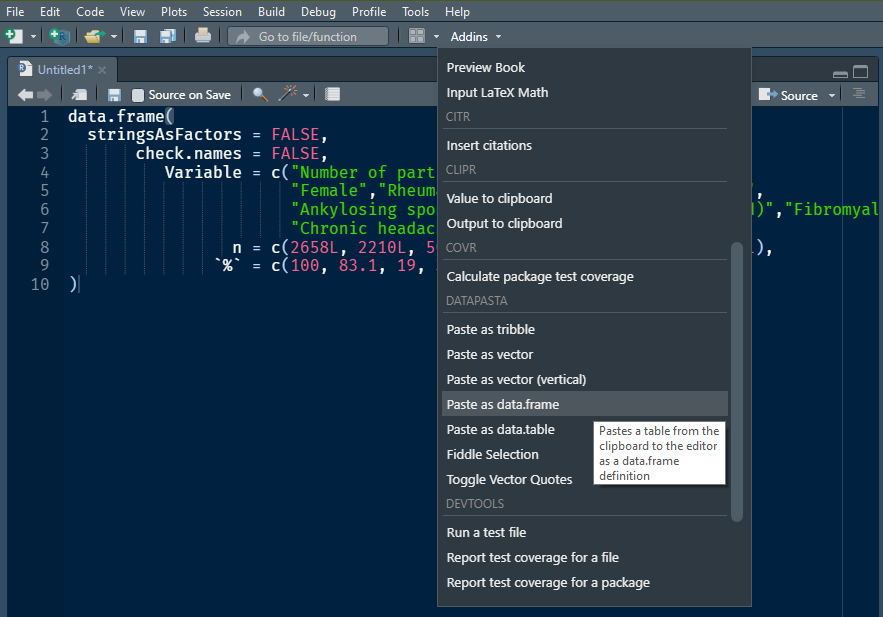

```{r setup, include=FALSE}
knitr::opts_chunk$set(echo = TRUE)
```

## Motivating examples

*By James Gwinnutt and Stephanie Shoop-Worrall*

- [James's example script](baseline_tables2.R) <i class="fab fa-r-project" title=".R"></i>
- [Stevie's slides](Stevie summarising data.pptx) <i class="fas fa-file-powerpoint" title=".pptx"></i>

### Computing summary statistics with tidyverse

The [`iris` dataset](https://en.wikipedia.org/wiki/Iris_flower_data_set) is built into R and gives the measured widths and lengths of sepals and petals for 150 examples of three different species of iris.

Let's compute some 'baseline' summary statistics for these data using the package **dplyr** (part of the **tidyverse** family of packages).

For a single variable, such as the `Petal.Length`, we can calculate species-level statistics as follows.

```{r}
data(iris)
library(tidyverse)
iris %>%
  group_by(Species) %>%
  summarise(mean = mean(Petal.Length),
            sd = sd(Petal.Length),
            n = n(),
            median = median(Petal.Length),
            Q1 = quantile(Petal.Length, .25),
            Q3 = quantile(Petal.Length, .75),
            IQR = IQR(Petal.Length),
            IQR1 = Q3 - Q1) # just another way of calculating iqr
```

If we want to compute the same summaries for the other variables: petal width, sepal width and sepal length, then we _could_ just repeat the code above, swapping the name `Petal.Length` each time.
But there is a better, less repetitive way.

Using another **tidyverse** package called **tidyr**, we can reshape the dataset into a long (rather than wide) table.

```{r}
(iris_long <- iris %>%
  pivot_longer(-Species))
```
Instead of a separate column for each type of measurement, we have one column for the variable names and one for the values.
Then the `name` can be just another group to pass to `group_by`:

```{r}
iris_long %>%
  group_by(Species, Variable = name) %>%
  summarise(mean = mean(value),
            sd = sd(value),
            n = n(),
            median = median(value),
            Q1 = quantile(value, .25),
            Q3 = quantile(value, .75),
            IQR = IQR(value))
```

From here, see the last section on how we might turn this into a publication-quality table like below.

```{r, echo = FALSE}
summary_tbl <- iris_long %>%
  group_by(Species, Variable = name) %>%
  summarise(mean = mean(value),
            sd = sd(value),
            n = n(),
            median = median(value),
            Q1 = quantile(value, .25),
            Q3 = quantile(value, .75),
            IQR = IQR(value),
            .groups = 'drop') %>%
  mutate(label = sprintf('%s (N = %d)', Species, n),
         Variable = gsub('\\.', ' ', Variable))

summary_tbl %>%
  select(-Species, -label, -n) %>%
  kableExtra::kable(col.names = c(' ',
                                  'Mean', 'SD',
                                  'Median', 'Q1', 'Q3', 'IQR'),
                    digits = 1) %>%
  kableExtra::kable_paper('striped') %>%
  kableExtra::pack_rows(index = table(summary_tbl$label)) #%>%
  #kableExtra::collapse_rows(1:2, valign = 'top')
```
### Recoding variables

Sometimes variables aren't quite in the data type that we want.
For example, we might want to split a continuous variable like BMI into categories based on pre-specified cutpoints.
Suppose our vector of BMIs was

```{r}
bmi <- c(29.4, 11.4, 24.5, 19.1, -0.6, 7.9, NA, 20.1, 30, 40.9)
```

And the pre-specified groups boundaries are at 0, 18.5, 25, 30, 35 and 40.
One way of doing this would be a series of nested `ifelse()` expressions.

```{r}
ifelse(bmi >= 0 & bmi < 18.5, '[0, 18.5)',
       ifelse(bmi >= 18.5 & bmi < 25, '[18.5, 25)',
              ifelse(bmi >= 25 & bmi < 30, '[25, 30)',
                     ifelse(bmi >= 30 & bmi < 35, '[30, 35)',
                            ifelse(bmi >= 35 & bmi < 40, '[35, 40)',
                                   ifelse(bmi >= 40, '40+', NA))))))
```

However, this is tedious to write, error-prone and unnecessarily verbose.
There are built-in functions to do this!
One is called `cut()` and the other is called `findInterval()`.
The former creates a factor variable, labelled according to the interval in which each value falls.
The latter is similar but just returns an integer corresponding to the interval.

```{r}
cutpoints <- c(0, 18.5, 25, 30, 35, 40)
cut(bmi, cutpoints)
```

By default, anything greater than the last cutpoint (or smaller than the first), if passed to `cut()`, is categorised as `NA`.
To avoid this happening, you can set the first and last cutpoints to arbitrarily small and high numbers, respectively (such as `-Inf` and `+Inf`).

Negative BMIs are clearly invalid but let's try to keep the 40+ ones.
To match the first example, let's also have the intervals open (exclusive) on the right:

```{r}
cut(bmi, c(cutpoints, Inf), right = FALSE)
```

Alternatively, the related function `findInterval()` will classify anything before the first cutpoint as group 0 and anything after the last cutpoint as group $n_\text{cutpoints}+1$.

```{r}
findInterval(bmi, cutpoints)
```

Explore the documentation for both functions to see what other options are available.

Now let's use what we've learnt to count the number of patients in each group.
Suppose the data are stored in a data frame called `bmi_data`:

```{r, echo = F}
(bmi_data <- data.frame(id = seq_along(bmi),
                       bmi = bmi))
```

Then a **dplyr** approach might be

```{r}
bmi_data %>%
  mutate(bmi_group = findInterval(bmi, cutpoints)) %>%
  count(bmi_group)
```

Here's a base R solution, using automatic labels and treating negative BMIs as invalid.

```{r}
bmi_data <- transform(bmi_data,
                      bmi_group = cut(bmi, c(cutpoints, Inf)))

table(bmi_data$bmi_group)
table(bmi_data$bmi_group, useNA = 'ifany')
```

### Merging categories

Imagine we want to merge categories that have fewer than 10 people in them, for confidentiality purposes.
There are many ways you might do this.

```{r, echo = -(1:2)}
countries <- na.omit(countrycode::codelist$country.name.en[
  countrycode::codelist$continent == 'Europe'])
example_data <- tibble(id = 1:500,
                       country = sample(countries, 500, TRUE),
                       score = round(abs(rnorm(500, 22, 5))))
example_data
```
One way is to `add_count`s for each group, then mutate using `ifelse`.
Here I am creating a new column called `new_country` so you can compare them.

```{r}
example_data %>%
  add_count(country, name = 'N') %>%
  mutate(new_country = ifelse(N < 10, 'Other', country))
```

Alternatively, you might use the `fct_lump_min` (factor lump) function from the **forcats** ("for categorical variables") package, which is specifically designed for this sort of task.
There are lots of other fun functions for manipulating categorical variables in that package; [check it out](https://forcats.tidyverse.org/)!

```{r}
example_data %>%
  mutate(new_country = forcats::fct_lump_min(country, min = 10))
```

Or if you prefer **data.table**, this solution is analogous to using `dplyr::add_count`.
The row-indexing syntax saves us a call to `ifelse` (or `fifelse` or `if_else`...).

```{r}
library(data.table)
setDT(example_data)
example_data[, N := .N, by = country]
example_data[N < 10, country := 'Other']
example_data
```

### Counting missing values

How much missing data is there for each variable in the baseline table?
Here's an example using the `airquality` dataset (which is built into base R and contains some missing values).

```{r}
data(airquality)
head(airquality)
```
The base `summary` function will report `NA` counts, if any.

```{r}
summary(airquality)
```
Or you can loop over the columns and compute the counts and proportions:

```{r}
airquality_nas <- airquality[, 1:4]
airquality_nas[] <- lapply(airquality_nas, is.na)
colSums(airquality_nas)
100 * colMeans(airquality_nas)
```

In **dplyr**, it might look something like this:

```{r}
airquality %>%
  pivot_longer(Ozone:Temp) %>% # ignore Day & Month
  group_by(name) %>%
  summarise(total = n(),
            present = sum(!is.na(value)),
            missing = sum(is.na(value)),
            `% present` = 100 * present / total,  # or mean(!is.na(value))
            `% missing` = 100 * missing / total)  # or mean(is.na(value))
```

And in **data.table**:

```{r}
setDT(airquality)
airquality[, lapply(.SD, is.na)][,
                                 .(column = names(.SD),
                                   total = .N,
                                   missing = sapply(.SD, sum),
                                   `% missing` = sapply(.SD, mean),
                                   present = .N - sapply(.SD, sum),
                                   `% present` = 1 - sapply(.SD, mean))]
```

## The TableOne package

*By Ruth Costello*

The R package [`tableone`](https://cran.r-project.org/web/packages/tableone/vignettes/introduction.html) quickly produces a table that is easy to use in medical research papers.
Given a specification of variables (`vars`), factors (`factorVars`) and groups (`strata`), it computes common summary statistics automatically.

For example:

```{r, eval = FALSE}
library(tableone)
CreateTableOne(
  vars = c('Petal.Length', 'Petal.Width'),
  strata = 'Species',
  data = iris
)
```

```
                          Stratified by Species
                           setosa      versicolor  virginica   p      test
  n                          50          50          50                   
  Petal.Length (mean (SD)) 1.46 (0.17) 4.26 (0.47) 5.55 (0.55) <0.001     
  Petal.Width (mean (SD))  0.25 (0.11) 1.33 (0.20) 2.03 (0.27) <0.001     
```

Another example:

```{r, echo = -1}
library(tableone)
CreateTableOne(
  vars = c('age', 'sex', 'state', 'T.categ'),
  factorVars = c('state', 'sex', 'T.categ'),
  data = MASS::Aids2
)
```

Other, similar packages you might like try include:

- Package [`TableOne`](https://github.com/agapiospanos/TableOne) (not on CRAN; based on [this paper](https://ebmh.bmj.com/content/23/3/127))
- Package [`table1`](https://cran.r-project.org/web/packages/table1/vignettes/table1-examples.html)
- Package [`gtsummary`](http://www.danieldsjoberg.com/gtsummary/)

## Neater knitr tables

*By David Selby*

### Generating tables by hand

If copying data from an external source (rather than calculating it yourself),
then you might simply want to write in the data by hand.
For this you can use a Markdown table, for instance, the following Markdown pipe table is copied from the supplementary materials of @Dixon2019 and annotated with a Markdown caption.

Table: Participants in the _Cloudy with a Chance of Pain_ study [@Dixon2019]

| Variable                |    n |    % |
| :---------------------- | ---: | ---: |
| Number of participants  | 2658 |  100 |
| Female                  | 2210 | 83.1 |
| Rheumatoid arthritis    |  506 | 19.0 |
| Osteoarthritis          |  926 | 34.8 |
| Ankylosing spondylitis  |  235 |  8.8 |
| Gout                    |   97 |  3.6 |
| Arthritis (unspecified) |  972 | 36.6 |
| Fibromyalgia            |  665 | 25.0 |
| Chronic headache        |  271 | 10.2 |
| Neuropathic pain        |  371 | 14.0 |

using the following Markdown 'pipe table' syntax:

```markdown
Table: Participants in the _Cloudy with a Chance of Pain_ study (Dixon et al, 2019)

| Variable                |    n |    % |
| :---------------------- | ---: | ---: |
| Number of participants  | 2658 |  100 |
| Female                  | 2210 | 83.1 |
| Rheumatoid arthritis    |  506 | 19.0 |
| Osteoarthritis          |  926 | 34.8 |
| Ankylosing spondylitis  |  235 |  8.8 |
| Gout                    |   97 |  3.6 |
| Arthritis (unspecified) |  972 | 36.6 |
| Fibromyalgia            |  665 | 25.0 |
| Chronic headache        |  271 | 10.2 |
| Neuropathic pain        |  371 | 14.0 |
```

But you don't need to space the syntax perfectly. This works just as well:

```markdown
Variable | n | %
:--- | ---: | ---:
Number of participants | 2658 |  100
Female | 2210 | 83.1
Rheumatoid arthritis |  506 | 19.0
Osteoarthritis |  926 | 34.8
Ankylosing spondylitis | 235 | 8.8
Gout | 97 |  3.6
Arthritis (unspecified) | 972 | 36.6
Fibromyalgia | 665 | 25.0
Chronic headache | 271 | 10.2
Neuropathic pain | 371 | 14.0
```

Which you can leave as-is, or you can neaten up *automagically* using the RStudio Addin **Beautify Table** from the [`beautifyR` package](https://github.com/mwip/beautifyR). Install the addin from GitHub using the syntax
```r
devtools::install_github('mwip/beautifyR')
```
then highlight your Markdown table and click *Addins > Beautify Table* from the toolbar.

Suppose you want to do some calculations with the copied data---not just display it in a table.
You could enter it into a data frame by hand, using base syntax or the (slightly easier to read) `tibble::tribble` function:

```{r}
my_tbl <- tibble::tribble(
                  ~Variable,    ~n, ~`%`,
   "Number of participants", 2658L,  100,
                   "Female", 2210L, 83.1,
     "Rheumatoid arthritis",  506L,   19,
           "Osteoarthritis",  926L, 34.8,
   "Ankylosing spondylitis",  235L,  8.8,
                     "Gout",   97L,  3.6,
  "Arthritis (unspecified)",  972L, 36.6,
             "Fibromyalgia",  665L,   25,
         "Chronic headache",  271L, 10.2,
         "Neuropathic pain",  371L,   14
  )
```

Thence, wrap the data frame in a call to `kable`, `xtable` or `pander` within a script or code chunk (or print it in an R Markdown code chunk with your YAML header set to `df_print: kable`).

```r
knitr::kable(my_tbl)
pander::pander(my_tbl)
xtable::xtable(my_tbl)
```

```{r echo = FALSE}
knitr::kable(my_tbl, 'markdown')
```

### Copy and paste

But manually typing in these values is still tedious and error-prone.
Can't we just copy and paste?
*Yes we can*, with the [`datapasta` package](https://github.com/milesmcbain/datapasta).
Install the package:
```r
install.packages('datapasta')
```
Copy your source table to the clipboard (e.g. from a webpage or Word document) and then select *Addins > Paste as (format)* into code chunk or script.
(I used it to generate the `tribble` code above!)



### Complex kable tables

Functions like `kable` [@Xie2014] and `pander` are straightforward to use for simple tables, but do not have many advanced features.
For that, try using the package [`kableExtra`](https://haozhu233.github.io/kableExtra/) [@kableExtra], which adds just about all the functionality you could ever really need.

Here are some examples.

```{r}
library(kableExtra)
options(knitr.table.format = 'html')
```

#### Add header rows to group columns

```{r}
kable(my_tbl) %>%
  kable_styling() %>%
  add_header_above(c(' ' = 1, 'Final case-crossover study cohort' = 2))
```


#### Add indents to group rows implicitly

```{r}
knitr::kable(my_tbl) %>%
  add_indent(c(2, 4), level_of_indent = 1)
```

#### Add labels to group rows explicitly

```{r}
knitr::kable(my_tbl) %>%
  pack_rows('Demographics', 2, 2) %>%
  pack_rows('Health conditions', 3, 10)
```

#### Collapse rows that are repeated

```{r, message = FALSE, echo = -(1:2)}
options(knitr.kable.NA = '')
engagement_days <- data.frame(
  Cluster = rep(c('High', 'Medium', 'Low', 'Very Low'),
                  each = 3),
  Engagement = rep(c('Days in study',
                     'No. days with pain data',
                     '% days with pain data'),
                   times = 4),
  Min = c(61, 4, NA, 22, 2, NA, 2, 1, NA, 1, 1, NA),
  Q1 = c(130, 104, 73, 48, 26, 38, 4, 2, 32, 1, 1, 100),
  Median = c(203, 160, 82, 91, 40, 52, 10, 5, 56, 1, 1, 100),
  Q3 = c(319, 254, 89, 182, 72, 67, 21, 9, 81, 1, 1, 100),
  Max = c(456, 449, NA, 456, 311, NA, 452, 64, NA, 291, 2, NA)
) %>%
  transform(Cluster = factor(Cluster,
                             c('High', 'Medium', 'Low', 'Very Low')),
            Engagement = factor(Engagement,
                                c('Days in study',
                                  'No. days with pain data',
                                  '% days with pain data')))

kable(engagement_days) %>%
  kable_styling() %>%
  collapse_rows(valign = 'top')

library(dplyr)
## Rearrange and sort the columns:
engagement_days %>%
  select(Engagement, Cluster, Min:Max) %>%
  arrange(Engagement, Cluster) %>%
  kable() %>%
  kable_styling %>%
  collapse_rows(valign = 'top')
```

Perhaps clearer representations of the same information:

```{r boxplot, echo = FALSE, warning = FALSE, fig.width = 6, fig.height = 2}
library(ggplot2)
ggplot(engagement_days) +
  aes(Cluster, Median) +
  geom_linerange(aes(ymin = Min, ymax = Q1)) +
  geom_linerange(aes(ymin = Q3, ymax = Max)) +
  geom_point(size = 1) +
  facet_wrap(~ Engagement,
             scales = 'free_x',
             ncol = 3) +
  coord_flip() +
  theme_minimal() +
  labs(x = NULL, y = NULL)

engagement_days %>%
  filter(Engagement != '% days with pain data') %>%
  mutate(Engagement = factor(Engagement,
                             labels = c('Any', 'Pain'))) %>%
  ggplot() +
  aes(Cluster, Median, group = Engagement,
      fill = Engagement) +
  geom_errorbar(aes(ymin = Min, ymax = Max),
                position = 'dodge', width = .5) +
  geom_crossbar(aes(ymin = Q1, ymax = Q3),
                 position = 'dodge', width = .5) +
  scale_fill_discrete('Data days') +
  ylab(NULL) +
  theme_minimal()
```

#### Add styling

By default, a `kableExtra`-infused table (a `kbl`) is unformatted.
You can make it look like the default `knitr` formatting again:

```{r}
grouped_tbl <-
  kable(my_tbl) %>%
  pack_rows('Demographics', 2, 2) %>%
  pack_rows('Health conditions', 3, 10)

grouped_tbl %>%
  kable_styling()
```

Or better yet, pick from fancier themes and options:

```{r}
grouped_tbl %>%
  kable_paper(full_width = FALSE)

grouped_tbl %>%
  kable_paper('striped', full_width = FALSE)

grouped_tbl %>%
  kable_classic('striped', full_width = FALSE)

grouped_tbl %>%
  kable_minimal(full_width = FALSE)

grouped_tbl %>%
  kable_material('hover')
```

Worried about losing formatting?
You can automatically save the resulting table as an image with `kableExtra::as_image()`.

(However, this is **not recommended** because bitmap screenshots are neither scalable nor searchable and are inaccessible for people with disabilities.)

```{r fig.align = 'center', out.width = '100%', fig.width = 6}
grouped_tbl %>%
  kable_paper('striped', full_width = T) %>%
  as_image(file = 'table.png', zoom = 3)
```

Check the [documentation for `kableExtra`](https://haozhu233.github.io/kableExtra/) to see what else is possible.
Results in other formats (such as PDF) may vary.

## Further reading

- [kableExtra and Word](https://haozhu233.github.io/kableExtra/kableExtra_and_word.html)
- [`gt`](https://blog.rstudio.com/2020/04/08/great-looking-tables-gt-0-2/)
- [`gtsummary`](http://www.danieldsjoberg.com/gtsummary/)
- [`flextable`](https://davidgohel.github.io/flextable/)
- $\LaTeX$ package [`booktabs`](http://mirror.ox.ac.uk/sites/ctan.org/macros/latex/contrib/booktabs/booktabs.pdf):

  > "It is not going too far to say that if you cannot create a table using the commands in this package, you should redesign it."

- ROpenSci did a [feature comparison of the various table making packages](https://htmlpreview.github.io/?https://github.com/ropenscilabs/packagemetrics/blob/master/inst/examples/tableGallery.html) back in 2017.
