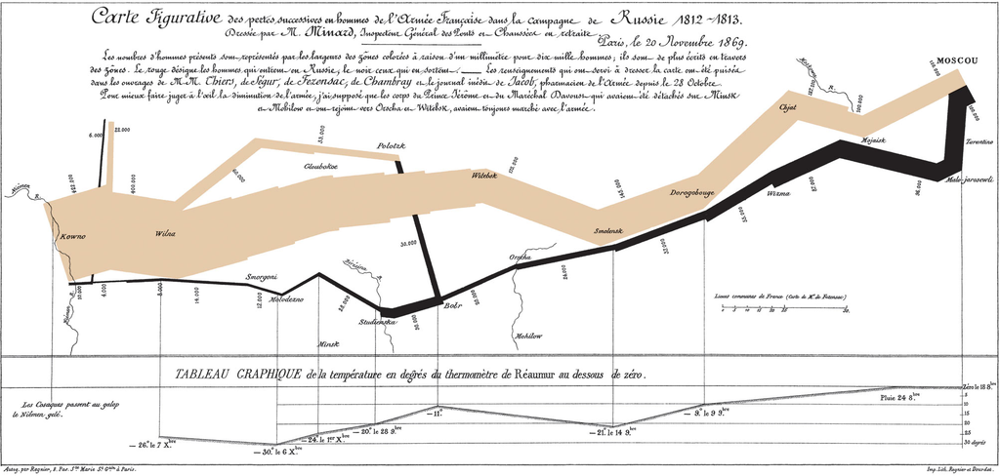

```{r setup, include=FALSE}
knitr::opts_chunk$set(echo = FALSE,
                      dev = 'svg', fig.width = 6, fig.height = 4)
```

## Presentation

- [_The Grammar of Graphics_ slides](https://selbydavid.com/ggtalk)
- [Source code](https://github.com/selbosh/ggtalk) <i class="fab fa-github"></i>
- [_An introduction to ggplot2_ slides](https://selbydavid.com/vignettes/ggplot2.html)

```{r}
if (!interactive()) {
  knitr::include_url('https://selbydavid.com/ggtalk')
}
```

## Types of charts

Can you name the following data visualisations?

```{r scatter}
library(ggplot2)
ggplot(iris) +
  aes(Sepal.Width, Sepal.Length, colour = Species) +
  geom_point() + theme_classic() +
  theme(legend.position = 'none') +
  xlab('Sepal width') + ylab('Sepal length')
```

```{r linegraph}
ggplot(data.frame(y = 4 * ((20:1) + rnorm(20)))) + aes(1:20, y) +
  theme_classic() + theme(legend.position = 'none') +
  xlab('Time') + ylab('Audience interest') +
  geom_line(size = 1, aes(colour = '1'))
```

```{r barchart}
ggplot(data.frame(
  count = c(4, 40 - 4),
  Slides = c('Shown', 'Remaining')
)) +
  theme_classic() +
  aes(Slides, count, fill = Slides) +
  geom_bar(stat = 'identity') +
  xlab(NULL) + ylab(NULL) + ggtitle('Slides') +
  theme(legend.position = 'none')
```

```{r piechart}
ggplot(data.frame(
  count = c(6, 40 - 6),
  Slides = c('Shown', 'Remaining')
)) +
  aes(x = '', count, fill = Slides) +
  geom_bar(stat = 'identity', width = 1) +
  theme_classic() +
  coord_polar(theta = 'y') +
  theme(axis.ticks = element_blank(),
        axis.text = element_blank()) +
  xlab(NULL) + ylab(NULL)
```

```{r dotplot}
ggplot(faithful) +
  theme_classic() +
  aes(eruptions, fill = '1', colour = '1') +
  scale_y_continuous(NULL, breaks = NULL) +
  xlab('Eruption duration, mins') +
  geom_dotplot(show.legend = FALSE, binwidth = 0.08)
```

```{r radar}
coord_radar <- function (theta = 'x',
                         start = 0,
                         direction = 1) {
  theta <- match.arg(theta, c('x', 'y'))
  r <- ifelse(theta == 'x', 'y', 'x')
  ggproto(
    'CoordRadar',
    CoordPolar,
    theta = theta,
    r = r,
    start = start,
    direction = sign(direction),
    is_linear = function(coord)
      TRUE
  )
}

ggplot(data.frame(
  x = c('Speed', 'Price', 'Reliability', 'Comfort', 'Cupholders'),
  y = round(runif(5 * 3, 1, 5)),
  z = rep(letters[1:3], each = 5)
)) +
  aes(x, y, group = z, colour = z) +
  scale_y_continuous(limits = c(0, 5.5), breaks = 1:5) +
  scale_x_discrete(limits = c('Speed', 'Price', 'Reliability', 'Comfort', 'Cupholders')) +
  geom_polygon(fill = NA,
               size = 1.5,
               show.legend = FALSE) +
  coord_radar() +
  theme_classic() +
  theme(
    axis.ticks.y = element_blank(),
    axis.text.y = element_blank(),
    panel.grid.major.y = element_line(size = .5, colour = '#dfdfdf'),
    panel.grid.major.x = element_line(size = .5, colour = '#dfdfdf'),
    panel.border = element_blank()
  ) +
  xlab(NULL) + ylab(NULL)
```

```{r boxplot}
ggplot(mpg, aes(class, hwy, colour = '1')) +
  ggthemes::geom_tufteboxplot(show.legend = FALSE) +
  ylab('Highway miles per gallon') + xlab(NULL) +
  theme_classic() + theme(axis.ticks.y = element_blank()) +
  coord_flip()
```

```{r lollipop}
ggplot(data.frame(
  brand = c('Dairy Milk', 'Galaxy', 'Kit-Kat', 'Mars'),
  sales = c(490978872, 213379376, 106845438, 98178362)
)) +
  aes(brand, sales, colour = '1', fill = '1') +
  geom_bar(stat = 'identity', width = 0.02) +
  geom_point(size = 6) +
  scale_y_continuous(
    labels = function(n)
      paste0('£', n / 1e6, 'm')
  ) +
  xlab(NULL) + ylab(NULL) +
  theme_classic() + theme(legend.position = 'none', axis.ticks.x = element_blank())
```

## The Grammar of Graphics

### The book


(ref:grammar) @Wilkinson2006 Figure 2.2

```{r fig.cap = '(ref:grammar)'}

```

> "The grammar of graphics determines how **algebra, geometry, aesthetics, statistics, scales** and **coordinates** interact"

### Variables

Operations applied **before** scale transformations

- Mathematical transforms (`sin`, `log`)
- Sorting and ranking
- Aggregation
- Quantiles
- Residuals

### Algebra

Let $A := (x,y,z)$ and $B := (a,a,b)$.

- Cross $A\times B = ([x,a],~[y,a],~[z,b])$
- Nest $A/B = (x|a,~y|a,~z|b)$
- Blend $A+B =  (x,y,z,a,a,b)$


### Scales

- Categorical
- Interval
- Time
- One-bend (log, power)
- Two-bend ([arcsine](https://esajournals.onlinelibrary.wiley.com/doi/full/10.1890/10-0340.1), logit, probit)
- Probability

> "Graphics do not care about the scales on which they are drawn"
> `r tint::quote_footer('Wilkinson (2006)')`

```{r scalesmonth, fig.height = 0.8}
scalesgg <- ggplot() + theme_classic() + theme(axis.line.x=element_line(), plot.margin=unit(c(1,2,1,2),"lines"))
scalesgg +
  scale_x_continuous(name="Month", breaks=cumsum(c(0,31,28,31,30,31,30,31,31,30,31,30)), limits=c(0,334), minor_breaks=NULL,
                     labels=c('Jan','Feb','Mar','Apr','May','Jun','Jul','Aug','Sep','Oct','Nov','Dec'),
                     expand=c(0,0))
```

```{r scalesweek, fig.height = 0.8}
scalesgg +
  scale_x_continuous(name="Calendar", breaks=c(1:7, 7*(2:4), 2*28), minor_breaks=NULL, limits=c(1,2*28),
                     labels=c(1:7, paste(2:3,'weeks'), '1 month', '2 months'),
                     expand=c(0,0))
```

```{r scalesasn, fig.height = 0.8}
asn <- function(x) 2*asin(sqrt(x))
scalesgg +
  scale_x_continuous(name="Arcsine", breaks=asn(seq(0, 1, by=0.1)), limits=asn(c(0,1)), minor_breaks=NULL,
                     labels=seq(0, 1, by=0.1),
                     expand=c(0,0))
```

### Statistics

**After** scale & variable transformations  
**Before** coordinate transformations

- Regression coefficients
- Smoothers
- Binning and aggregation
- Confidence intervals
- Density estimation

### Geometry

Things we can actually see

Functions | Partitions | Networks
--------- | ---------- | --------
point<br>line<br>area<br>interval<br>path<br>schema   | contour<br>polygon    | edge

**Collision modifiers:** stack, dodge, jitter

### Coordinates

> "Ordinary graphics such as intervals and polygons take on radically different
appearances under different planar transformations."

- [Cartesian coordinates](https://en.wikipedia.org/wiki/Cartesian_coordinate_system)
- [Triangular coordinates](https://en.wikipedia.org/wiki/Ternary_plot)
- [Polar coordinates](https://en.wikipedia.org/wiki/Polar_coordinate_system)
- [Map projections](https://en.wikipedia.org/wiki/Map_projection)
- [Conformal mapping](https://en.wikipedia.org/wiki/Conformal_map)

```{r coord, out.width = '100%'}
stack <- ggplot(diamonds) +
  aes(x = "", fill = cut) +
  geom_bar(width = 1) +
  scale_y_continuous(NULL, breaks = NULL) +
  scale_x_discrete(NULL, breaks = NULL) +
  theme_classic() +
  scale_fill_brewer(type = 'seq')

bullseye <- stack + coord_polar(theta = "x")

stack
bullseye

#multiplot(stack, bullseye, cols=2)
```

A new graphic? Or a transformation of an existing one?

### Aesthetics

Form | Surface | Motion | Sound | Text
---- | ------- | ------ | ----- | ----
position<br>size<br>shape<br>rotation<br>resolution | colour<br>texture<br>blur<br>transparency | direction<br>speed<br>acceleration | tone<br>volume<br>rhythm<br>voice | label

> "Much of the skill in graphic design is knowing what combinations
of attributes to avoid."

(ref:faces) @Wilkinson2006 Figure 10.11

```{r fig.cap = '(ref:faces)'}

```

## Putting it all together

Demonstration using R package `ggplot2` [@Wickham2010].

### Let's make a pie chart

`Titanic` dataset

```{r echo=2}
Titanic <- as.data.frame(Titanic)
head(Titanic)
theme_titanic <- function() theme_classic() +
  theme(axis.title=element_blank(),
        axis.text=element_blank(),
        axis.ticks=element_blank())
```

**Algebra:** `Class` &times; `Survived` &times; `Freq`

```{r, echo=1}
pie <- ggplot(Titanic) +
  scale_x_discrete() + scale_y_continuous() + scale_fill_discrete() +
  geom_bar(width = 1, position = "fill") +
  aes(x = "", fill = Survived, weight = Freq) +
  theme_titanic()
pie
```

```{r echo=1}
pie + coord_polar(theta = "y")
```

```{r echo=1, fig.height=2, out.width='100%'}
pie + coord_polar(theta = "y") +
  facet_grid( ~ Class)
```

```{r out.width='100%', fig.width=4, fig.height=3, echo=TRUE}
gg <- ggplot(Titanic) +
  scale_x_discrete() + scale_y_continuous() + scale_fill_discrete() +
  geom_bar(width = 1, position = 'stack') +
  aes(x = Class, fill = Class, weight = Freq) +
  theme_titanic()

gg + coord_polar(theta = 'x') + ggtitle('Rose')
gg + coord_polar(theta = 'y') + ggtitle('Racetrack???')
```

(ref:coxcomb) @Nightingale1858

```{r fig.cap='(ref:coxcomb)'}
knitr::include_graphics('nightingale_rose.jpg')
```

### Napoleon's March

(ref:minard) @Minard1869 ([view larger](https://ugc.futurelearn.com/uploads/assets/6f/43/6f4328de-e711-4ec1-808a-555d9a2692c8.png))

```{r fig.cap = '(ref:minard)'}

```

```{r minard, echo=FALSE, out.width='100%', fig.width=10, fig.height=4}
## Source: https://github.com/bborgesr/Stats_Capstone
troops <- read.table("minard-troops.txt", header=T)
cities <- read.table("minard-cities.txt", header=T)
troops$group <- factor(troops$group, levels=3:1) ## layer order
troops$variable <- cities$variable <- "map"
temperatures <- data.frame(temp=c(0, 0, -9, -21, -11, -20, -24, -30, -26),
                           long=c(37.6, 36.0, 33.2, 32.0, 29.2, 28.5, 27.2, 26.7, 25.3),
                           date=c('18 Oct','24 Oct','9 Nov','14 Nov','','28 Nov','1 Dec', '6 Dec', '7 Dec'),
                           variable="temp")
theme_minard <- function() {
  theme_classic() +
    theme(axis.text = element_blank(),
          axis.ticks = element_blank(),
          axis.title = element_blank(),
          legend.position="right")
}
scale_minard <- function() {
  list(scale_size_continuous(range = c(0.5, 12), labels=scales::comma,
                             guide = guide_legend(title = 'Survivors')),
       scale_colour_manual(values = c("#E7CAAA", "#CACACA"), labels=c("Advance", "Retreat"),
                           guide = guide_legend(title = 'Direction',
                                                override.aes = list(size=5))))
}

gg <- ggplot(troops, aes(x = long, y = lat))
gg <- gg + geom_path(aes(size = survivors,
                         colour = direction,
                         group = group), lineend = "round")
gg <- gg + geom_text(data = cities, aes(label = city),
                     size = 3, family = "serif", fontface = "italic")
gg <- gg + theme_minard() + scale_minard()
gg
```

```{r minard_code, ref.label='minard', echo=24:30, eval=FALSE, size=1}
```

```{r minard2, out.width="100%", fig.width=10, fig.height=6}
(gg <- gg + facet_wrap( ~ variable, dir = "v", scales = "free_y") +
  geom_line(data = temperatures, aes(y = temp, colour = "R")) +
  geom_text(
    data = temperatures,
    aes(y = temp, label = temp),
    parse = TRUE,
    nudge_x = 0.1,
    nudge_y = +2,
    family = "serif"
  ) +
  geom_text(
    data = temperatures,
    aes(y = -32, label = date),
    nudge_x = 0.1,
    nudge_y = -2,
    family = "serif",
    size = 3
  ) +
  scale_x_continuous(breaks = temperatures$long) +
  theme(panel.grid.major.x = element_line(colour = "#efefef", size = 0.2)) +
  geom_text(
    data = data.frame(
      variable = "temp",
      long = 28,
      temp = -5
    ),
    aes(long, temp),
    label = "Temperature on return path (degrees Réaumur)",
    size = 5,
    family = "serif"
  ) +
  theme(
    legend.position = "none",
    strip.text = element_blank(),
    panel.spacing = unit(0, "lines")
  ))
```

Or, with the more familiar default `theme_grey()`:

```{r minard3, out.width="100%", fig.width=10, fig.height=6}
gg + theme_grey()
```

## Resources

### Implementations

- [Graphics Production Language](https://www.dummies.com/education/math/statistics/working-with-graphics-production-language-in-ibm-spss-statistics/) (SPSS)

- [ggplot2](https://ggplot2.tidyverse.org/), [ggvis](https://ggvis.rstudio.com/) (R)

- [plotnine](https://towardsdatascience.com/how-to-use-ggplot2-in-python-74ab8adec129), [Bokeh](https://bokeh.org/) (Python)

- [Gadfly](http://gadflyjl.org/stable/) (Julia)

- [D3.js](https://d3js.org/), [Vega](http://vega.github.io/vega/) (JavaScript)

- [Grammarphone](http://angusscott.github.io/GoldsmithHack) (Spotify API)

- [`asciiplot`](asciiplot.R) <i class="fab fa-r-project"></i>

```{r echo=TRUE}
source('asciiplot.R')
asciiplot(
  df = iris,
  aes = list(x = 'Petal.Width', y = 'Petal.Length', shape = 'Species'),
  geom = 'point'
)
```

### Further reading

- Article: [Chernoff faces in ggplot2](https://selbydavid.com/2017/06/25/ggchernoff/) `r emo::ji('face')`

- Article: [Using ggplot2 with Stata](http://www.hargaden.com/enda/blog/using-rs-ggplot2-with-stata/)

- Cheatsheet: [Data Visualisation with ggplot2](https://rstudio.com/wp-content/uploads/2015/03/ggplot2-cheatsheet.pdf) (by RStudio)

- [Charles Annis on the "IntraOcular Trauma Test"](http://www.statisticalengineering.com/intraocular.htm)

- [Source code repository for these slides](http://github.com/Selbosh/ggtalk)
