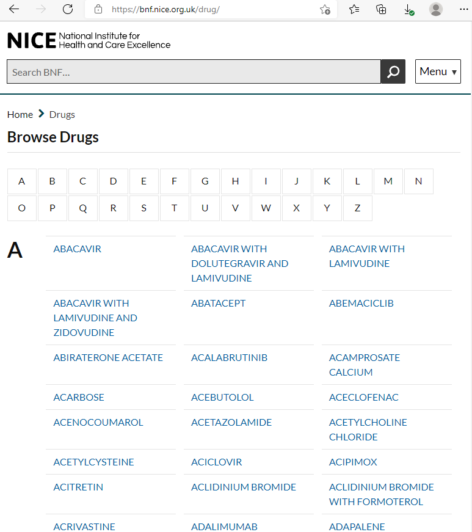

class: inverse, middle

```{r setup, include = FALSE}
options(htmltools.dir.version = FALSE )
knitr::opts_chunk$set(comment = '#', message = FALSE)
```

```{r xaringan-logo, echo=FALSE}
if (!require(xaringanExtra)) remotes::install_github('gadenbuie/xaringanExtra')
xaringanExtra::use_logo(
  image_url = 'https://www.cfe.manchester.ac.uk/media/mhs/bmh-faculty/images/CfE-logo-150px.jpg',
  width = '100px', height = '75px',
  position = xaringanExtra::css_position(bottom = '.3em', right = '0em')
)
```

# Structure

## 1. Why Web scraping?

## 2. Intro to HTML/CSS

## 3. Web scraping with rvest

---

class: inverse, middle, center

# Why Web scraping?

---

## Why Web scraping?

- There's lots of useful information online

- Not everything is a CSV file!

- Faster / less error-prone than copying data manually

- Fun

---

## Motivating example

.pull-left[

British National Formulary

.small[
- https://bnf.nice.org.uk/drug/
- One page per drug
- Drug dose indications
]
]

.pull-right[]

---

class: inverse, middle, center

# HTML for dummies

---

### Example HTML document

```html
<HTML>
  <HEAD>
    <TITLE>The title of my Web page</TITLE>
  </HEAD>
  <BODY>
    <H1>A heading</H1>
    <P>A paragraph about something.</P>
    <P>A second paragraph about something <em>else</em></P>
    
    <UL> <!-- This is an unordered list -->
      <LI>A <A HREF="https://cfe.manchester.ac.uk">hyperlink</A>.
      <LI>Another list item</LI>
    </UL>
  </BODY>
</HTML>
```

---

### Example HTML document

<iframe src="example.html" style="width:80%; height: 70%"></iframe>

---

### Example HTML document

```html
<HTML>
  <HEAD>
    <TITLE>The title of my Web page</TITLE>
  </HEAD>
  <BODY>
    <H1 ID="headline">A heading</H1>
    <P CLASS="intro">A paragraph about something.</P>
    <P>A second paragraph about something <em>else</em></P>
    
    <UL> <!-- This is an unordered list -->
      <LI>A <A HREF="https://cfe.manchester.ac.uk">hyperlink</A>.
      <LI>Another list item</LI>
    </UL>
  </BODY>
</HTML>
```

---

### Cascading style sheets (CSS)

Use **tags**, **classes** and **ids** to identify objects in the DOM.

_e.g._ Select the headline text:

- `h1`
- `h1#headline` &nbsp;(or&nbsp; `#headline`)
- `body:first-child`

_e.g._ Select the introduction paragraph:

- `p.intro` &nbsp;(or&nbsp; `.intro`)
- `p:first-of-type`
- `h1+p`
- `body:nth-child(2)`

---

### Cascading style sheets (CSS)

Style:

1. change the typeface
2. centre the headline
3. highlight the intro paragraph
4. shrink the logo image

Add the following in `<style> </style>` tags:

```css
body { font-family: 'Comic Sans MS'; }
h1#headline { text-align: center; }
.intro { background-color: yellow; }
.logo { width: 100px; }
```

---

### Example HTML document with CSS

<iframe src="example2.html" style="width:80%; height: 70%;"></iframe>

---

### The element inspector

Explore the document object model (DOM) of any Web page:


---

### SelectorGadget

https://rvest.tidyverse.org/articles/selectorgadget.html

```{r selectorgadget, echo = FALSE, out.width = '60%'}
knitr::include_graphics('https://rvest.tidyverse.org/articles/selectorgadget-2-s.png')
```

---

class: inverse, middle, center

# Web scraping with rvest

---

### Web scraping with rvest

```{r rvest intro, echo = -3}
library(rvest)
example <- read_html('example.html')
example
example %>% html_element('.intro')
example %>% html_element('.intro') %>% html_text()
```

---

### Web scraping with rvest

```{r drug index, echo = -5, comment = ''}
drug_index <- read_html('https://bnf.nice.org.uk/drug/')
drug_links <- drug_index %>% html_elements('.row ul li a')
drugs <- data.frame(name = html_text2(drug_links),
                    path = html_attr(drug_links, 'href'))
head(drugs)
```

---

### Web scraping with rvest

```{r wrapper function, message = FALSE}
library(tidyverse)
scrape_drug <- function(path) {
  webpage <- read_html(file.path('https://bnf.nice.org.uk/drug/', path))
  name_of_drug <- webpage %>% html_element('h1') %>% html_text2
  condition_grp <- webpage %>% html_elements('.indicationAndDoseGroup')
  condition_name <- map(condition_grp, ~ html_element(.x, '.indications') %>% html_text2)
  tibble(name_of_drug,
                 condition = map_chr(condition_name, paste, collapse = '\n'),
                 route_grp = map(condition_grp, html_elements, '.dosage-group') %>% map_depth(2, as.list)) %>%
    unnest(route_grp) %>%
    mutate(route = map_chr(route_grp, ~ html_elements(.x, 'span.routesOfAdministration') %>% html_text2),
           patient_grp = map(route_grp, html_elements, 'li.dose') %>% map_depth(2, as.list)) %>%
    unnest(patient_grp) %>%
    mutate(patient = map_chr(patient_grp, ~ html_element(.x, '.patientGroup span') %>% html_text2),
           dose = map_chr(patient_grp, ~ html_elements(.x, 'p') %>% html_text2)) %>%
    select(-ends_with('_grp'))
}
```

---

### Ibuprofen example

```{r ibuprofen}
scrape_drug('ibuprofen.html')
```

---

## More information

- <https://rvest.tidyverse.org>

- Blog post: _'Which film should I watch during lockdown?'_  
<https://selbydavid.com>

- E-mail me: <david.selby@manchester.ac.uk>

### Upcoming R-thritis meetings

<dl>
<dt>19 November</dt>
<dd>Topic/presenter to be confirmed</dd>
<dt>3 December</dt>
<dd>&lsquo;Advent of Code&rsquo; discussion</dd>
</dl>
