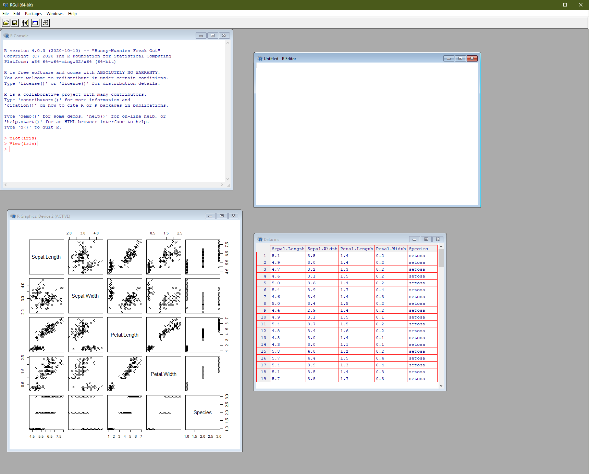

This worksheet is based on the first lecture of the [**Statistical Modelling in Stata**](https://personalpages.manchester.ac.uk/staff/mark.lunt/stats_course.html) course, created by Dr Mark Lunt and offered by the [Centre for Epidemiology Versus Arthritis](https://www.cfe.manchester.ac.uk/) at the University of Manchester.
The original Stata exercises and solutions are here translated into their R equivalents.

Refer to the original slides and Stata worksheets [here](https://personalpages.manchester.ac.uk/staff/mark.lunt/stats_course.html).

As a direct transliteration of the ['Essentials of the Stata Language'](https://personalpages.manchester.ac.uk/staff/mark.lunt/stats/1_Intro_to_stata/text.pdf), this guide is _not_ intended to be a canonical introduction to R.
Rather, it is meant as a demonstration and explanation of how R compares to Stata.
Some concepts in the Stata language do not necessarily apply to the R language, or are approached with a different philosophy.
Where these divergences are significant, I will do my best to give an explanation.

For a more standard introduction to R, consider reading through the official guide [_An Introduction to R_](https://cran.r-project.org/manuals.html) or check out the page on [Getting Help with R](https://www.r-project.org/help.html).
There are also many free online tutorials and resources on the web, for example the book [_R for Data Science_](https://r4ds.had.co.nz/).
Consider subscribing to [R-bloggers](https://www.r-bloggers.com/)!

```{r setup, include=FALSE}
knitr::opts_chunk$set(echo = TRUE)
```

## Basic concepts

[R](https://www.r-project.org/) is a command line scripting language.
You can run it directly from a command line or terminal, but most users prefer some kind of graphical user interface (GUI).
When you download R, it comes with a very basic GUI that is little more than a command window and a script editor.

[RStudio](https://rstudio.com) is a very popular integration development environment (IDE) for R.
Essentially, it acts like an advanced terminal and text editor for your R scripts, but with added quality of life features like auto-completion, keyboard shortcuts and built-in tools for debugging, creating new documents or getting help.
Other tools are available, including [Emacs Speaks Statistics](https://ess.r-project.org/), [Eclipse](https://www.eclipse.org/) and [IntelliJ IDEA](https://www.jetbrains.com/idea/), which offer similar levels of features.
These IDEs (including RStudio) can also be used with other programming languages, not just R.

You do not need an IDE to write or run R code, but it helps!

### Main R windows

If you open up RGui (on your desktop the program will be called something like R x64 4.0.3) you will get an interface something like in Figure \@ref(fig:rgui).
The **R Console** is a command line where you can enter R commands and see text-based output.
Open or create a new script and the **R Editor** will open.
This is where you should actually write your analysis code, as you can rerun, save and retrieve whole files (saved with the `.R` extension) rather than just type one line at a time.
In the console you can use the up and down arrow keys to repeat previously-typed lines of code.

Another window that might appear during your analysis is the **Data** window, essentially a primitive spreadsheet viewer for inspecting tabular datasets.
Access it using the `View(dataset)` function, where `dataset` is the name of the object you want to look at.
Finally, the **R Graphics Device** is a window for previewing plots and visualisations.
You don't have to view them here---you can alternatively save plots directly to a file and open them in your favourite image viewer.

```{r rgui, fig.cap = 'The basic R graphical user interface'}

```

By default, everything you type is saved to a log file called `.Rhistory`, which will appear in My Documents, or your working directory.
However, don't rely on this: you are much better off organising your code into R scripts or [R Markdown documents](https://personalpages.manchester.ac.uk/staff/david.selby/rthritis/2021-01-15-literate-programming/).

Chances are, you may never actually use this R GUI, as you may prefer to use an IDE.
RStudio and other programs have a similar set of windows, sometimes arranged differently and with extra functionality (such as a dedicated window for viewing help files and vignettes).

### Command syntax

R is a fully-fledged [functional programming language](https://en.wikipedia.org/wiki/Functional_programming), with (some) [object-orientated](https://en.wikipedia.org/wiki/Object-oriented_programming) features.
More details on the syntax are covered in [_An Introduction to R_](https://cran.r-project.org/manuals.html) so here we'll just compare it with Stata.

A **function** in R takes the form `fun(args)` where `fun` is the name of the function and `args` are **arguments** (parameters, options, inputs) passed to it.
Different functions take different numbers of arguments; some take none at all.
A function is analogous to a Stata _command_, but unlike Stata there is no particular distinction between a `varlist` and `options`; all are passed as arguments.

If you want to inspect an object, type its name or value.

```{r}
42
pi
```

Every action in R is a function invocation, and if you don't specify a function explicitly then it is inferred as a call to `print()`.
The above commands are implicitly the same as:

```{r}
print(42)
print(pi)
```

In this case, the function is `print()` and the arguments are respectively the literal value `42` and the numeric variable `pi`.

On this page, if you click on function names in code blocks (like above) then it will take you to the help page for that function.

Every 'thing' in R is an **object**, even functions themselves.
This means you can inspect it, assign it to a variable and pass it to a function.

In R, most objects are _immutable_, which means simply applying a function to it does not change its value or properties.
You need to **assign** or re-assign the result of a function invocation to a symbol (a variable name) for it to have any effect^[Strictly speaking, [`assign()`](https://rdrr.io/r/base/assign.html) (an alias for the assignment operator [`<-`](https://rdrr.io/r/base/assignOps.html)) is also a function, whose side effect is to map objects to symbols/names.].
Thus, if you want to get any work done, you could assign the results of each function call to variable.
The exception to this is printing or viewing results, plotting, or saving data to disk.
These are _side effects_ and need not change variables in your workspace.

To list all objects currently in your globally-accessible workspace, call

```{r, eval = FALSE}
ls()
```

and to end (quit) the R session, call

```{r, eval = FALSE}
q()
```

These are examples of functions that can be called without any arguments.
Most of the time, a function needs the name of one or more variables.
For example,

```{r, eval = FALSE}
summary(age)
```

will produce common summary statistics (mean, median, quartiles) of the `age` variable (assuming it exists), and

```{r, eval = FALSE}
lm(height ~ age + gender)
```

will fit a linear model to predict height as an additive function of age and gender.

Look in the documentation for a function to see what optional arguments it takes.
For example,

```{r, eval = FALSE}
summary(age, digits = 1)
```

yields the same summary statistics given to one significant figure.

#### Repeating previous commands

The command that has just been entered can be brought back to the console using the up arrow key.
Pressing this key repeatedly will bring back all of the previous function calls.
Press the down arrow key to get more recent commands.
In RStudio, there is also a **History** tab listing everything executed that session (and, depending on your settings, between sessions).

#### Variable name completion

If you enter the beginning of a variable or function name and then press the Tab key, R will complete the variable name as much as possible. If there are several possible completions, it will complete as far as possible and wait for further input.

## Manipulating variables

### Creating and modifying variables

#### Assignment

The simplest command to create a new variable is the assignment operator, `<-`.
(You can also use an equals sign `=`, though the `<-` operator has special properties that the equals sign doesn't.)

For example, if the date of birth is stored in the variable `date_of_birth` and the date the questionnaire was filled in is stored in `date_of_quest`, then the subject’s age at the time the questionnaire was completed can be calculated as

```{r, eval = FALSE}
age <- as.numeric(date_of_quest - date_of_birth) / 365.25
```

Test this yourself, using `as.Date()` to enter your own birthday and `Sys.Date()` to automatically generate today's date.
How old are you in years?
If I were born on 2 January 1990 then I am

```{r}
(age <- as.numeric(Sys.Date() - as.Date('1990-01-02')) / 365.25)
```

years old, on the day that this page was generated.

*Note.* Normally assignment is an _invisible_ operation (nothing is printed), but wrapping the expression in brackets means the value is also printed to the console.

In Stata, you need to `drop` a variable before assigning to it, if that name already exists, or use the `replace` command.
In R, the left hand side is always overwritten.
If, for some reason, you wanted to emulate the Stata behaviour, you could write a conditional expression like

```{r, eval = FALSE}
if (exists(age)) {
  stop('age already exists')
} else {
  age <- as.numeric(date_of_quest - date_of_birth) / 365.25
}
```

#### Data types

R's common data types are:

1. `logical` (`TRUE`, `FALSE`)
2. `integer` (`1L`, `2L`, `3L`)
3. `double` (`1.5`, `2e3`)
4. `complex` (`1+2i`, `0-3i`)
5. `character` (`"hello, world!"`)
6. `factor` (categorical with discrete and specified levels)
6. `list` (nested structures, e.g. `list(1, 2, 3)`)
7. `NULL` (empty; a vector of length zero)
8. `closure` (i.e. a function, e.g. `mean()`, `print()`)

Apart from functions, there's no such thing as a scalar; everything is a vector of some length (possibly zero or one).
If a vector is supplied a mixture of types, elements will be coerced to whichever type is the most complex.
Watch as this vector changes its class every time we add new elements:

```{r}
x <- TRUE
class(x)
x <- c(x, 2L)
class(x)
x <- c(x, 3.14)
class(x)
x <- c(x, 1 - 2i)
class(x)
x <- c(x, 'hello')
class(x)
x <- c(x, mean)
class(x)
```

Each of these types can be stored in different data structures.

1. vectors (all elements same type)
2. matrices (2-dimensional, all elements same type)
3. arrays (*n*-dimensional generalisation of matrix)
3. list (a collection of vectors, not necessarily the same type or length)
4. data frame (a list of vectors of equal length)

There is no exactly equivalent of a `label`, but vectors can have names, rows and columns in arrays and data frames can have `rownames` and `colnames`, and more generally dimensions can have `dimnames`.
Objects may also have `attributes`, which are metadata stored alongside it.

#### Missing values

Missing values in R are represented by `NA` (not available).
You can check if elements are missing using `is.na()`

```{r}
x <- c(1, NA, 3, 4)
is.na(x)
```
the logical values `TRUE` and `FALSE` are numerically equal to 1 and 0, respectively.
You can use this to count the number or proportion of missing values in a vector.

```{r}
sum(is.na(x))
mean(is.na(x))
```

Complementarily, count the number of non-missing values by negating the expression with the `!` ('not') operator.

```{r}
sum(!is.na(x))
mean(!is.na(x))
```

For display purposes, you can convert logical values to numeric types.

```{r}
as.numeric(TRUE)
as.numeric(FALSE)
as.numeric(is.na(x))
```

The reverse is also true.
Zero is coerced to `FALSE`, while any non-zero value is equivalent to `TRUE`.

```{r}
as.logical(-3:3)

if (42)
  print('Hello, world!')
```

Missingness is not the same thing as emptiness.
An `NA` means 'there should be an element here, but we don't know its value'.
An *empty* vector has no elements in it, missing or otherwise.

```{r}
length(NULL)
length(c())
length(numeric(0))
```

Apply `is.na` to an empty vector and you will get neither `TRUE`, nor `FALSE`; just an empty (logical) vector.

```{r}
is.na(NULL)
```

If you want to check a set is empty, use `length()`.
What does the following expression return?

```{r}
x <- c(-1, -2, -3, -4)
pos <- x[x > 0]
if (length(pos)) {
  print(pos)
} else print('No positive numbers in x')
```

### Selecting variables

In Stata, `drop` and `keep` allow you to remove or keep subsets of variables in a dataset.

In R, variables are _immutable_, so in general you cannot, strictly speaking, actually modify objects in place.
You can, however, replace the entire object with a manipulated copy of the same.

I can subset a vector to exclude negative numbers,
but unless I reassign the result, the object itself is not changed.

```{r}
x <- c(-1, 0, 2)
x[x > 0]       # prints positive elements
x              # unchanged
x <- x[x > 0]  # replaces x with a modified copy
x              # new x
```

You can also remove an object from the workspace completely using `rm()`.

```{r, error = TRUE}
x <- 42
x
rm(x)
x
```

You can also replace objects in place.
For example, this replaces all negative values with zeros.

```{r}
x <- c(-1, 0, 2)
x[x < 0] <- 0
x
```

Check what variables are currently in your workspace using `ls()` or the RStudio **Environment** tab.

### Formatting variables

See `?format`.

## Manipulating datasets

### Filenames

### Readings and saving data

### Combining datasets

## Other dataset manipulation commands

### `View`

The function `View()` opens a small spreadsheet viewer.
It works with most data structures, not just data frames.
You cannot edit data in this view, but you shouldn't want to, anyway.
In RStudio, you can also access this view by clicking on an object in the **Environment** tab.

### `save` and `read`

You can save your workspace to disk using `save` and restore it again with `read`.
The data is stored in an `.RData` file.
By default, R or RStudio will offer to do this for you at the start and end of each session.
*Always say no!*
It's good hygiene to start with a completely new workspace each session.

You can save individual R objects (rather than the whole workspace) to file using `saveRDS`, and retrieve them again with `readRDS`.
Only use this if you plan to pick up work where you left off or transfer objects between computers.
If saving data for others, use a more universal format, like CSV or json.
